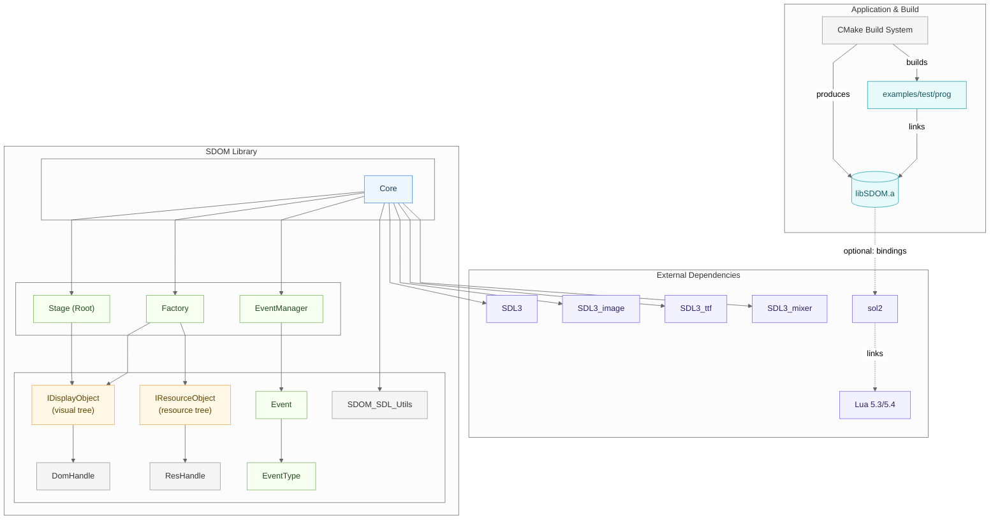
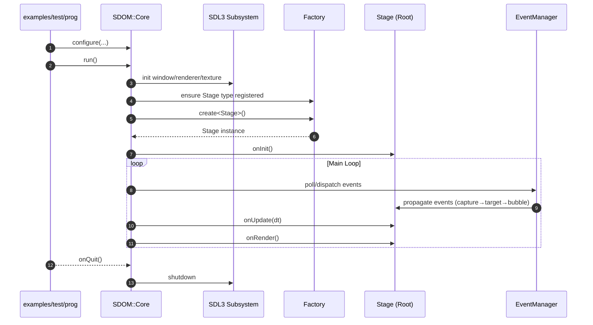

# Architecture Overview

SDOM is a lightweight C++ runtime and library built around a clear separation of concerns: a visual scene graph of display objects and a parallel graph of resources. The display tree is composed of IDisplayObject nodes that participate in layout, anchoring, rendering, and event handling. The resource tree is composed of IResourceObject nodes that own data such as images, fonts, audio, and configuration. Code refers to both worlds with type-safe handles (DomHandle for display objects, ResHandle for resources), keeping ownership centralized while allowing references to remain cheap, portable, and late-bound.

At the center is Core, a singleton that configures the system, owns the SDL window/renderer/texture, and drives the main loop. Core delegates to the Stage (the root display object) for initialization, updates, and rendering, and works with the EventManager to deliver input via capture → target → bubble phases across the display tree. SDL-focused utilities live alongside Core to isolate platform details, keeping application code small and testable.

Creation and lifetime of objects flow through the Factory. Types register themselves once; clients ask the Factory to create by type/name. The Factory maintains a name → pointer registry and returns typed handles rather than raw pointers, which decouples producers of references from the owners of objects. This design makes it straightforward to swap or reload resources, test in isolation, and build tools around a stable naming scheme.

The library integrates cleanly into CMake-based applications as a static archive (libSDOM.a), with an examples/test/prog illustrating usage. External dependencies focus on the SDL3 family (video, image, ttf, mixer). Scripting and configuration are implemented with Lua (via sol2). All data‑driven workflows and object creation use Lua tables and scripts; JSON configuration is no longer supported. The result is a small, composable core with clear extension points and a predictable runtime model.


<details>
<summary>View Mermaid source</summary>



</details>

Notes
- Core composes the SDL video subsystem (window, renderer, main texture) and orchestrates the main loop and callbacks.
- Factory owns and manages both display objects (IDisplayObject) and resource objects (IResourceObject), exposing safe handles for references.
- EventManager implements capture → target → bubble propagation phases across the display tree.
- External dependencies include the SDL3 family and sol2 + Lua for scripting.

### Migration note: Lua-first configuration

SDOM is Lua-first: configuration and scripting are implemented using Lua (via sol2). Native JSON-based configuration is no longer provided or bundled with SDOM. If you have existing JSON configuration files, you have two practical options:

1. Convert JSON files to Lua modules that return tables (recommended). Example conversion:

   JSON (example):

   ```json
   { "title": "MyApp", "size": [800, 600] }
   ```

   Lua module (equivalent):

   ```lua
   return {
     title = "MyApp",
     size = { 800, 600 },
   }
   ```

   Load the resulting module in C++/Lua with `require` or `dofile` and use the returned table directly.

2. If you must parse JSON at runtime rather than converting files, add a Lua JSON library to your application (for example `lua-cjson` or `dkjson`) or perform parsing in C++ and expose the resulting tables to the SDOM Lua state. SDOM intentionally does not ship or depend on a JSON parser.

Notes:
- Arrays in JSON map to numeric-keyed Lua tables; primitives map directly (strings, numbers, booleans).
- For bulk conversion, a small script (Python, Node, or Lua) that reads JSON and emits equivalent Lua table source can automate the work.

---

## Runtime Flow (High Level)

At runtime, an application (e.g., examples/test/prog) configures Core and calls run(). Core brings up the SDL subsystem (window, renderer, texture), ensures the Stage type is registered with the Factory, and creates the root Stage. After Stage::onInit, the main loop repeats: Core asks the EventManager to poll and dispatch input using capture → target → bubble phases across the display tree, then calls Stage::onUpdate(dt) followed by Stage::onRender(). When the program exits, Core performs an orderly shutdown of SDL and any owned systems. The sequence below is intentionally high‑level: it traces control through the primary actors and elides optional utilities and scripting for clarity.

Event propagation across the display tree proceeds in three phases: (1) capture, where the event travels from the root (Stage) down the ancestry path toward the target’s parent, invoking capture-registered listeners along the way; (2) target, where listeners attached to the target itself run; and (3) bubble, where the event ascends back up toward the Stage, invoking bubble-registered listeners on each ancestor. At each hop, the event’s current target reflects the node processing the event, while the logical target remains the original source. Handlers can short‑circuit further delivery (for example, to prevent duplicate handling) and can mark intent for default behavior as needed by the control.

Summary: Core orchestrates startup, the main loop, and shutdown; the Factory resolves names to live objects and resources via typed handles; the Stage anchors the visual tree; and the EventManager channels input through capture → target → bubble so UI code can respond at the appropriate layer. SDOM also supports organizing multiple “scenes” or screen layouts by swapping the root of the DOM tree. Each scene is simply a different Stage (or subtree) as the root, so you can transition screens without re‑initializing the engine. The flow below sketches these responsibilities without diving into optional subsystems.


<details>
<summary>View Mermaid source</summary>



</details>

This complements the per-module documents in the `docs/` folder (Core framework, anchoring, DOM propagation, extensible factory, handles, etc.).