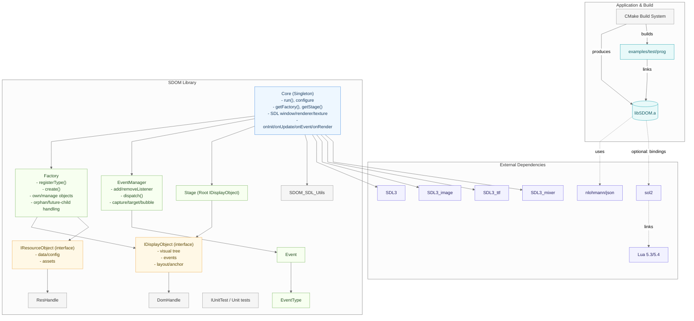
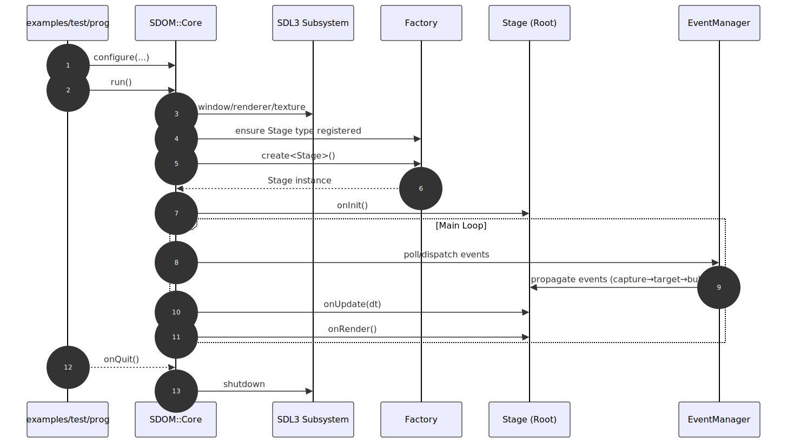
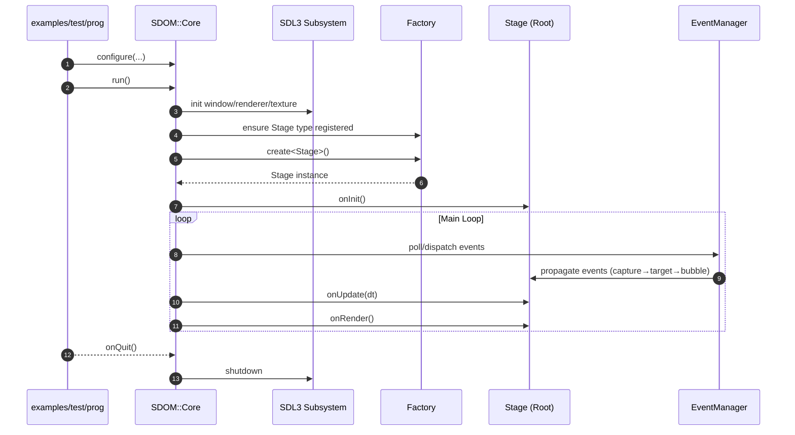

# SDOM Architecture Overview

This diagram captures the main components of SDOM, their relationships, and key external dependencies.

SVG (static image):

View Mermaid source

Notes
- Core composes the SDL video subsystem (window, renderer, main texture) and orchestrates the main loop and callbacks.
- Factory owns and manages both display objects (IDisplayObject) and resource objects (IResourceObject), exposing safe handles for references.
- EventManager implements capture → target → bubble propagation phases across the display tree.
- External dependencies include SDL3 family, nlohmann/json, and optionally sol2 + Lua for scripting.

---

## Runtime Flow (High Level)

SVG (static image):

View Mermaid source

This complements the per-module documents in the `docs/` folder (Core framework, anchoring, DOM propagation, extensible factory, handles, etc.).