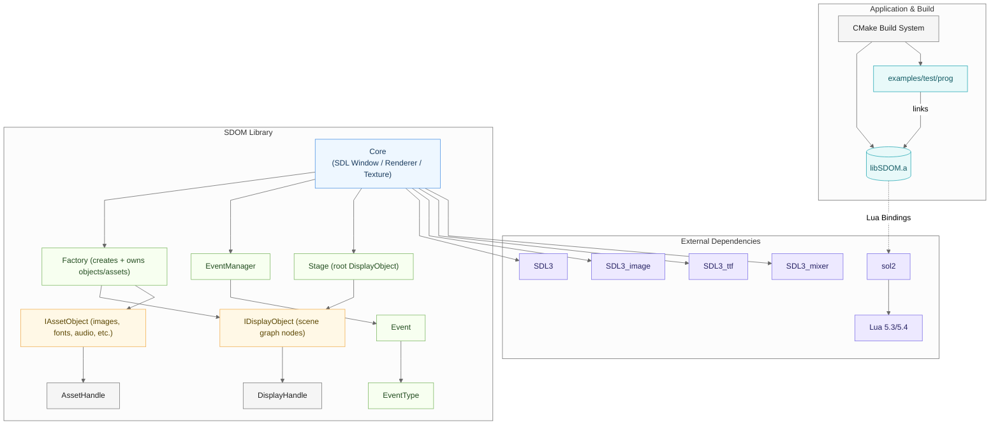
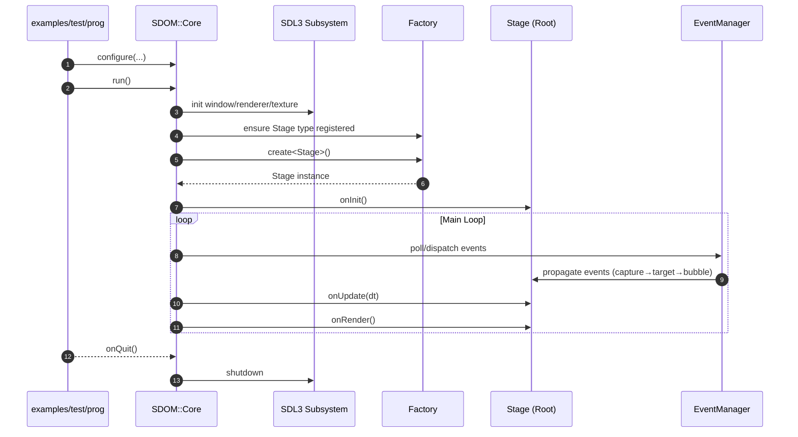

# Architecture Overview

SDOM is a lightweight C++ runtime and display framework built around a clear separation of concerns:
**display objects** (the scene graph) and **asset objects** (resources such as images, fonts, audio, etc.).
Application code interacts with both through **DisplayHandle** and **AssetHandle**, which provide stable,
name-based references without exposing raw pointers.

At the center of the system is **Core**, a singleton responsible for configuration, window and renderer setup, the main loop, and coordination of events. **Core** delegates rendering and updates to the root **Stage** display object, and works with the **EventManager** to deliver input and custom events using capture → target → bubble propagation across the display tree. SDL3-specific utilities and abstractions are contained within Core to isolate platform details and keep user-level code simple and testable.

Object and asset lifetimes flow through the **Factory**. Each concrete type registers its creation functions once; the Factory then creates objects by type and name on request. The Factory maintains a name→instance registry and returns typed handles instead of raw pointers, which decouples reference usage from ownership. This makes it straightforward to reload assets, inspect scene state, support live editing, and build external tooling around stable symbolic names.
SDOM integrates cleanly into CMake-based applications as a static library (**libSDOM.a**), and the repository includes example programs and a full automated test harness. External dependencies center on the SDL3 family (**video**, **image**, **ttf**, **mixer**). Configuration and data-driven object creation are handled through Lua (via sol2). All initialization, UI layout, resources, and behaviors can be expressed in Lua.

The result is a compact, composable framework with well-defined extension points and a predictable runtime model.

### Lua Integration (Optional by Design)

SDOM provides **first-class Lua bindings through sol2**, but Lua is **not required** to use the framework.
Developers can freely choose the level of scripting that fits their application:

| Usage Mode | Description |
|-----------|-------------|
| **No Lua** | Build your UI entirely in C++. Create display objects and assets directly via `Factory`. |
| **Hybrid (Recommended Default)** | Use Lua to **describe scenes**, styles, and layout; keep logic in C++. |
| **Full Lua** | Write your entire application in Lua, creating and controlling display objects dynamically. |

Regardless of scripting usage:

> **All rendering, layout, updates, and DOM traversal are executed in C++ — at full native performance.**

Lua calls simply **configure or trigger actions**, and never run inner draw loops or heavy allocations.

### Full-Lua Applications and Future Language Bindings

While SDOM can be used without Lua at all, the system is also designed so that **entire applications may be
implemented purely in Lua**. In this mode, Lua becomes the primary programming environment while SDOM provides:

- The display tree and layout system (IDisplayObject)
- The resource/asset system (fonts, textures, audio, etc.)
- Event dispatch and input handling
- Rendering and scene traversal

All of these continue to run at native C++ speed — Lua calls only *describe* or *control* behavior, never
perform the rendering work themselves.

#### Roadmap: Full SDL3 Binding for Lua

The long-term design goal is to expose **SDL3 and the SDL ecosystem directly to Lua**:
- `SDL3` core (windowing, input, surfaces, textures)
- `SDL3_ttf` (fonts)
- `SDL3_image` (image loading)
- `SDL3_mixer` (audio)
- `SDL3_video` (video playback, once stable)

This would allow developers to build **fully cross-platform SDL applications in Lua alone**, without touching C++
unless desired.

#### Multi-Language Binding Strategy

Because SDOM is built around **handle-based references and centralized resource ownership**, it is also
structurally well-suited for binding into other languages:

| Language | Binding State | Notes |
|---------|:-------------:|------|
| **Lua** | ✅ Current | Scene description + logic | 
| **Python** | Planned | Likely via `pybind11` |
| **Rust** | Planned | Likely via `cxx` or `bindgen` |
| **Other Languages** | Feasible | As long as they can call C API boundaries |

This positions SDOM as a **portable UI + graphics layer** shared across environments.

> **End-Goal:** A unified cross-platform development model where the same display system and SDL interfaces are
> available in C++, Lua, Rust, Python, and beyond — without rewriting UI stacks per language.


### Configuration Format (Lua Replaces JSON)

Earlier versions supported JSON, but JSON lacked comments and structural flexibility. Lua tables provide:

- Human-readable configuration
- Conditional layout logic when needed
- Component-style reusability
- Safe sandboxing support
- Zero re-parsing overhead once loaded

Lua here functions primarily as a **declarative UI configuration language**, not a game scripting VM unless
the developer wants it to be.

### Summary

- SDOM is **native-first**, deterministic, and real-time–friendly.
- Lua is **optional**, scaling from zero script usage to full application logic.
- UI graph traversal and rendering **always run in optimized C++**.
- Configuration is expressed in **Lua tables**, replacing JSON entirely.

---

### Why SDOM Uses C++ (Memory Safety and Design Intent)

SDOM is implemented in C++ by design. Real-time UI requires deterministic control over execution order, rendering, input handling, and memory ownership — all of which are explicit in C++.

While C++ is sometimes labeled “unsafe,” safety is ultimately an architectural responsibility. SDOM enforces:

- Centralized object creation through the Factory  
- Handle-based references instead of raw pointers  
- Explicit lifetime control and cleanup  
- Clear ownership rules for assets and display objects  
- Automated validation through unit tests

This eliminates the majority of the error cases associated with ad-hoc memory management.

Languages like Rust provide strong safety features, but still rely on `unsafe` blocks when interfacing with SDL, GPU drivers, and system libraries. SDOM simply makes those boundaries explicit, rather than hiding them — keeping system behavior transparent and under developer control.

```
==104184== LEAK SUMMARY:
==104184== definitely lost: 0 bytes
==104184== indirectly lost: 0 bytes
==104184== possibly lost: 676,279 bytes (GPU/driver allocations, safe to ignore)
==104184== still reachable: 12,123,577 bytes (expected persistent system buffers)
```

---

### In short:

- **C++ provides deterministic behavior** for real-time rendering and event handling.
- **Memory ownership is explicit**, not implicit or assumed.
- **Objects and resources are created and destroyed intentionally**, not automatically.
- **Safety is enforced structurally**, supported by unit tests and centralized lifetime control.

This approach ensures **performance, predictability, clarity, and extensibility** — core goals of SDOM as a general-purpose UI and display framework.


### High-Level Architecture Diagram



</details>

Notes
- Core composes the SDL video subsystem (window, renderer, main texture) and orchestrates the main loop and callbacks.
- Factory owns and manages both display objects (IDisplayObject) and resource objects (IResourceObject), exposing safe handles for references.
- EventManager implements capture → target → bubble propagation phases across the display tree.
- External dependencies include the SDL3 family and sol2 + Lua for scripting.

---

## Runtime Flow (High Level)

At runtime, an application (e.g., examples/test/prog) configures Core and calls run(). Core brings up the SDL subsystem (window, renderer, texture), ensures the Stage type is registered with the Factory, and creates the root Stage. After Stage::onInit, the main loop repeats: Core asks the EventManager to poll and dispatch input using capture → target → bubble phases across the display tree, then calls Stage::onUpdate(dt) followed by Stage::onRender(). When the program exits, Core performs an orderly shutdown of SDL and any owned systems. The sequence below is intentionally high‑level: it traces control through the primary actors and elides optional utilities and scripting for clarity.

Event propagation across the display tree proceeds in three phases: (1) capture, where the event travels from the root (Stage) down the ancestry path toward the target’s parent, invoking capture-registered listeners along the way; (2) target, where listeners attached to the target itself run; and (3) bubble, where the event ascends back up toward the Stage, invoking bubble-registered listeners on each ancestor. At each hop, the event’s current target reflects the node processing the event, while the logical target remains the original source. Handlers can short‑circuit further delivery (for example, to prevent duplicate handling) and can mark intent for default behavior as needed by the control.

Summary: Core orchestrates startup, the main loop, and shutdown; the Factory resolves names to live objects and resources via typed handles; the Stage anchors the visual tree; and the EventManager channels input through capture → target → bubble so UI code can respond at the appropriate layer. SDOM also supports organizing multiple “scenes” or screen layouts by swapping the root of the DOM tree. Each scene is simply a different Stage (or subtree) as the root, so you can transition screens without re‑initializing the engine. The flow below sketches these responsibilities without diving into optional subsystems.




</details>

This complements the per-module documents in the `docs/` folder (Core framework, anchoring, DOM propagation, extensible factory, handles, etc.).