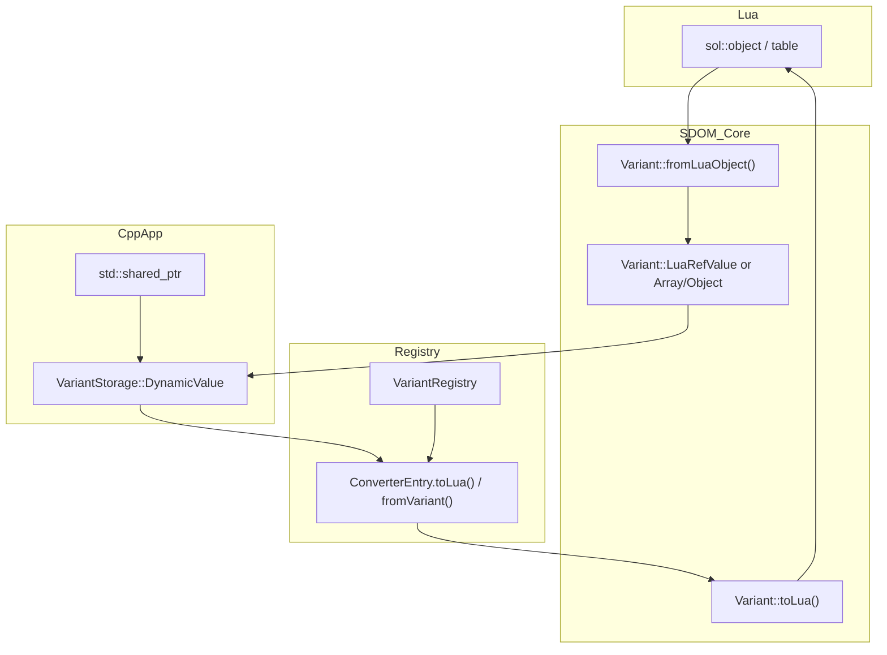
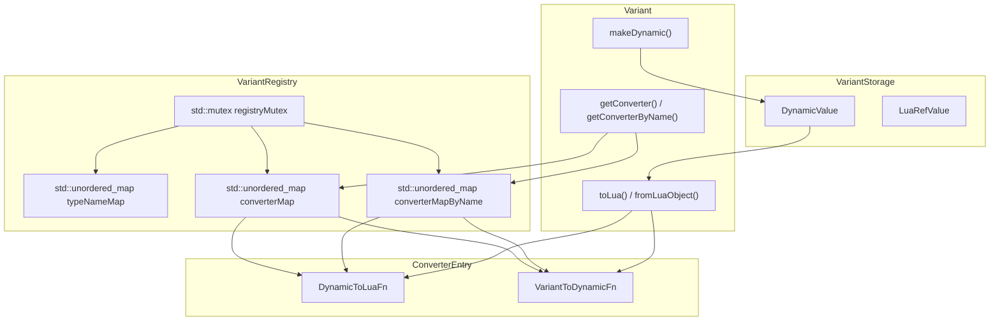
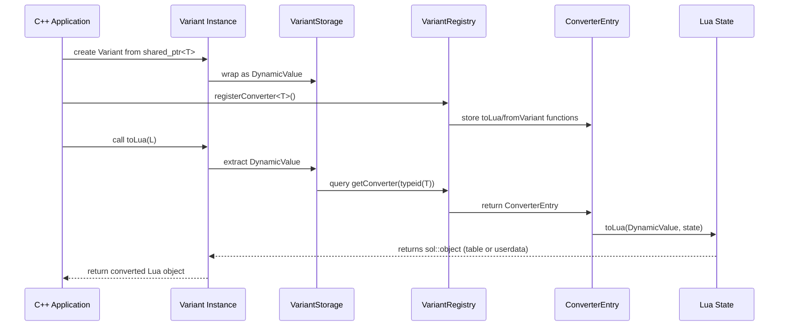
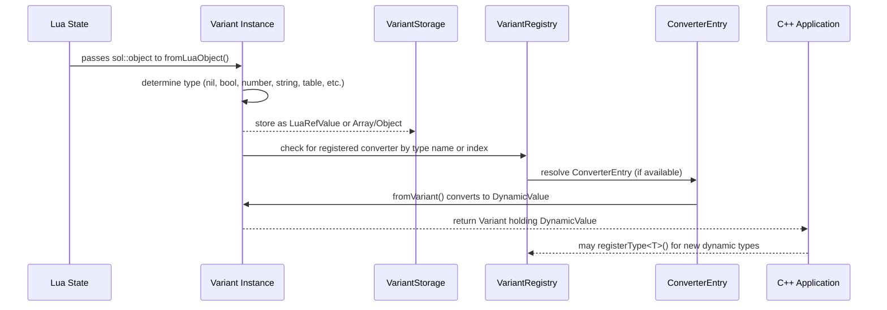

# SDOM Variant System — Complete Design Specification (v6)

## 📘 Table of Contents
1. [Introduction](#1-introduction)  
2. [Goals & Use Cases](#2-goals--use-cases)  
3. [Core Data Model](#3-core-data-model)  
4. [Type Extensibility](#4-type-extensibility)  
5. [Conversion System](#5-conversion-system)  
6. [Operator Model](#6-operator-model)  
7. [Performance & Memory Layout](#7-performance--memory-layout)  
8. [Error Handling and Validation](#8-error-handling-and-validation)  
9. [Logging & Debugging](#9-logging--debugging)  
10. [Future Expansion](#10-future-expansion)  
11. [Summary](#11-summary)

---

## 1. Introduction
### Design Motivation
The SDOM `Variant` class provides a unified, extensible, and type-safe container capable of representing all major data types exchanged between **C++**, **Lua**, and the SDOM runtime. It replaces fragmented per-type conversion logic with a centralized system for data storage, reflection, and inter-language interoperability.

### Role within SDOM’s Reflection and Lua Integration
`Variant` acts as the foundation for the **DataRegistry**, enabling the reflection and serialization of `IDataObject` instances. It ensures that any data in SDOM—whether primitive, structured, or composite—can be exposed to or derived from Lua scripts seamlessly.

### Guiding Principles
- **Simplicity:** One consistent, predictable data model for all systems.  
- **Safety:** Always return valid data or a clear error indicator.  
- **Interoperability:** Serve as the bridge for C++, Lua, and other future languages.  
- **Performance:** Measure twice, allocate once — minimize heap churn and runtime overhead.

---

## 2. Goals & Use Cases
- **Dynamic Reflection:** Enable runtime introspection and property querying.  
- **Type Conversion:** Unify and simplify type conversions between Lua, C++, and external systems.  
- **ABI Bridging:** Provide a common memory-safe interface for external language bindings.  
- **Lua & External Compatibility:** Represent data in a Lua-friendly structure (tables, primitives).  
- **Inspection:** Allow read-only access to existing Variants through lightweight `VariantView`.

---

## 3. Core Data Model
`Variant` internally uses `std::variant` to store any supported type safely and efficiently.

```cpp
std::variant<std::nullptr_t, bool, int64_t, double, std::string,
             std::vector<Variant>,
             std::unordered_map<std::string, Variant>,
             std::shared_ptr<void>,
             sol::object> data_;
```

### Supported Categories
| Category | Types |
|-----------|--------|
| **Primitives** | bool, int64_t, double, std::string |
| **Composite** | std::vector<Variant>, std::unordered_map<std::string, Variant> |
| **Dynamic** | std::shared_ptr<void> (user-defined extensible payload) |
| **Scripted** | sol::object (Lua reference or userdata) |
| **Special** | nullptr, error state |

### VariantType Enum
Each stored type corresponds to a unique `VariantType` enum value for quick runtime checks.

```cpp
enum class VariantType : uint8_t {
    Null = 0,
    Bool,
    Int,
    Real,
    String,
    Array,
    Object,
    Dynamic,
    LuaRef,
    Error
};
```

### VariantView
A lightweight, read-only view into a `Variant`, used to avoid copies when inspecting registry data.

```cpp
class VariantView {
    const Variant* ref_;
public:
    template<typename T> const T* try_get() const;
};
```

---

## 4. Type Extensibility
Users can extend the Variant system to support custom C++ types. The repository examples and the
Converter/Registry APIs use the name `registerConverter` for converter registration; use that form
to register a type and provide both serialization and deserialization paths (see examples below).

### Conversion Trait System
For consistency across types, all conversions use `VariantConverter<T>` specialization:

```cpp
template<typename T>
struct VariantConverter {
    static Variant fromLua(const sol::object&);
    static sol::object toLua(sol::state_view, const T&);
};
```

All registered types become available for reflection and serialization in the **DataRegistry**.

---

## 5. Conversion System
### C++ → Lua (Serialization)
- Converts C++ primitives and composite types into Lua tables or objects.  
- Handles nested data automatically (recursive flattening).

### Lua → C++ (Deserialization)
- Constructs Variants from Lua types (`sol::object`, `sol::table`, etc.).  
- Detects and wraps nested Lua structures recursively.

### Nested Tables
Lua tables map to `std::unordered_map<std::string, Variant>` internally.

```cpp
Variant fromLuaObject(sol::object o);
sol::table toLuaTable(sol::state_view L) const;
```

### Ownership Semantics
Variants holding `sol::object` maintain **weak references** to avoid dangling handles when Lua states are destroyed.

---

## 6. Operator Model
`Variant` provides native operator overloads for comparison and arithmetic operations:

```cpp
bool operator==(const Variant& rhs) const;
Variant operator+(const Variant& rhs) const;
```

### Comparison Matrix
| Operator | Allowed Types | Notes |
|-----------|----------------|-------|
| `==` | all comparable | cross-numeric coercion |
| `<, >` | numeric, string | error if mixed |
| `+` | numeric, string concatenation | error otherwise |

### Type-Safety Policies
No implicit type promotion beyond numeric coercion.  
Conversions between unrelated types trigger error states.

---

## 7. Performance & Memory Layout
- **Inline storage** for small types (primitives, small strings).  
- **Shared_ptr** management for larger containers (maps, vectors).  
- **Lazy Lua realization:** complex types convert to tables only when required.  
- **Target performance envelope:** < 50 ns for primitive get/set, minimal heap allocation during shallow copies.

---

## 8. Error Handling and Validation
### Default Error Model
Variants always return valid data. When an operation fails, it returns a special Variant with `hasError()` set.

```cpp
class Variant {
public:
    bool hasError() const { return error_; }
    std::string errorMessage() const { return errorMsg_; }
    static Variant makeError(const std::string& msg) {
        Variant v; v.error_ = true; v.errorMsg_ = msg; return v; }
private:
    bool error_ = false;
    std::string errorMsg_;
};
```

### Nested Error Contexts
Errors within nested structures accumulate context for easier debugging:

```
VariantError: key 'color' → expected table {r,g,b,a}, got number
```

### Compile-Time Error Modes
| Mode | Behavior | Use Case |
|------|-----------|----------|
| **Safe (Default)** | Returns error-marked Variant | Runtime builds |
| **Strict** | Throws `VariantTypeError` | Debug & testing |
| **Silent ABI** | No logs, only error flags | External bindings |

---

## 9. Logging & Debugging
All Variant operations integrate with SDOM’s binding macros:

```cpp
BIND_LOG("Variant::toObject() conversion successful");
BIND_WARN("Variant::toNumber() missing fields, defaulting");
BIND_ERR("Variant::fromLuaObject() invalid Lua type");
```

### toString() / Debug Dump
`Variant::toString(int depth = 1)` returns a human-readable representation of nested Variant content.

---

## 10. Future Expansion
- **DataRegistry Synchronization:** Variants form the atomic unit for reflection.  
- **C ABI Harness:** Variant serialization can directly power C-side testing.  
- **ScriptManager Integration:** Unified handling of cross-language bindings (Lua, Python, etc.).  
- **VariantView Optimization:** Allow non-owning traversal of reflected objects.  
- **Type Traits:** Support pluggable reflection via compile-time adapters.

---

## 11. Summary
- Unified dynamic type system for SDOM.  
- Robust Lua ↔ C++ conversion pipeline.  
- Operator-safe, reflection-ready, and error-aware.  
- Extensible for future languages and DataRegistry.  
- Configurable runtime modes for stability or debugging.  
- Includes conversion traits, VariantView, and nested error propagation.

---

**Version:** 6.0 (Enhanced)  
**Author:** Jay Faries (warte67)  
**Project:** SDOM

---

## 12. Quick Reference & Examples

This section provides working examples for the concrete `Variant` API additions implemented in the codebase (converter registry, dynamic helpers, Lua ownership modes, and `VariantView`). These snippets are C++ examples intended to be used inside SDOM modules or tests.

### Registering a converter for a C++ type (by type)

```cpp
// A sample C++ type
struct TestPoint { int x; int y; };

// Create converter entry
Variant::ConverterEntry ce;
ce.toLua = [](const VariantStorage::DynamicValue& dv, sol::state_view L) -> sol::object {
    auto p = std::static_pointer_cast<TestPoint>(dv.ptr);
    sol::table t = L.create_table();
    t["x"] = p ? p->x : 0;
    t["y"] = p ? p->y : 0;
    return t;
};
ce.fromVariant = [](const Variant& v) -> std::shared_ptr<void> {
    auto out = std::make_shared<TestPoint>();
    if (v.isObject()) {
        const Variant* vx = v.get("x"); if (vx) out->x = static_cast<int>(vx->toInt64());
        const Variant* vy = v.get("y"); if (vy) out->y = static_cast<int>(vy->toInt64());
    }
    return std::static_pointer_cast<void>(out);
};

// Register converter for TestPoint (registers both by type_index and name)
Variant::registerConverter<TestPoint>("TestPoint", std::move(ce));
```

### Registering a converter by name only

```cpp
Variant::ConverterEntry ce_name = /* fill as above */;
Variant::registerConverterByName("RuntimeOnlyType", std::move(ce_name));
```

This is useful for runtime or opaque types where a concrete C++ type is not available at registration time.

### Creating Variants for dynamic types

Create a Variant from a shared_ptr<T>:

```cpp
auto p = std::make_shared<TestPoint>(); p->x = 1; p->y = 2;
Variant v = Variant::makeDynamic<TestPoint>(p); // holds DynamicValue
// convenience: construct in-place
Variant v2 = Variant::makeDynamic<TestPoint>(/* ctor args for TestPoint */);
```

Use `Variant::makeDynamicValue<T>(shared_ptr<T>)` to obtain a `VariantStorage::DynamicValue` when calling converters directly.

### Inspecting dynamic type metadata

```cpp
auto tn = v.dynamicTypeName(); // optional<string> => "TestPoint"
auto ti = v.dynamicTypeIndex(); // std::type_index(typeid(TestPoint))
```

### Snapshotting Lua tables vs keeping Lua references

By default, Lua tables are copied into Variant `Object`/`Array` structures (a deep snapshot). To store the Lua table as an opaque reference instead, toggle:

```cpp
Variant::setTableStorageMode(Variant::TableStorageMode::KeepLuaRef);
Variant v = Variant::fromLuaObject(sol_table);
// v.isLuaRef() will be true when KeepLuaRef is set

// To get a deep copy of a stored LuaRef table:
Variant snapshot = v.snapshot(); // returns a Variant::Object/Array copy

// Restore default
Variant::setTableStorageMode(Variant::TableStorageMode::Copy);
```

### Lightweight read-only traversal with VariantView

```cpp
Variant v = Variant::fromLuaObject(some_table);
Variant::VariantView view(v);
if (view.isObject()) {
    if (const Variant* val = view.get("key")) {
        // read-only inspection without copies
        int n = val->toInt64();
    }
}
```

These examples should be directly usable in unit tests or modules inside the `examples/test` harness. For more advanced usage (registering converters for complex nested types, round-trip tests, or per-Core registries) consult the header comments in `include/SDOM/SDOM_Variant.hpp` which contain short usage notes and caveats.

---
### Lua Conversion Flow Diagram


The **Lua Conversion Flow Diagram** illustrates the full round-trip between the Lua runtime and SDOM’s internal C++ types. A `sol::object` or Lua table is first passed through `Variant::fromLuaObject()`, where it becomes either a `LuaRefValue` (if stored by reference) or a deep-copied **Array**/**Object**. From there, any dynamic data is represented as a `VariantStorage::DynamicValue`, linking the Lua layer to a C++ `std::shared_ptr<T>`. When converting back, `Variant::toLua()` consults the `VariantRegistry` and its associated `ConverterEntry` objects to translate native C++ types into Lua tables or values. This bi-directional pathway ensures that all conversions between C++ and Lua remain type-safe, extensible, and reflection-aware.


---
## 🧩 **Variant Lifecycle State Diagram**

```mermaid
stateDiagram-v2
    [*] --> Null : Default constructed

    Null --> Assigned : set() / push() / constructor
    Assigned --> Array : makeArray()
    Assigned --> Object : makeObject()
    Assigned --> Dynamic : makeDynamic<T>()
    Assigned --> LuaRef : fromLuaObject
    Assigned --> Error : makeError("msg")

    Array --> toLua : toLua()
    Object --> toLua : toLua()
    Dynamic --> toLua : ConverterEntry.toLua()
    LuaRef --> toLua : validated reference

    toLua --> LuaTable : Lua receives Variant data
    LuaTable --> fromLua : Variant.fromLuaObject
    fromLua --> Assigned

    LuaRef --> Snapshot : snapshot()
    Snapshot --> Object : deep copy of table
    Snapshot --> Array : deep copy of list

    Assigned --> Error : invalid conversion
    Error --> [*] : hasError() / log

    Dynamic --> Registered : registerType<T>()
    Registered --> ConverterLookup : getConverter / getByName
    ConverterLookup --> toLua : Dynamic → Lua
    ConverterLookup --> fromVariant : Lua → Dynamic
    fromVariant --> Assigned

    Object --> VariantView : read-only traversal
    Array --> VariantView : read-only traversal
    VariantView --> [*] : non-owning access complete
```

---
### Variant Lifecycle State Diagram

The **Variant Lifecycle State Diagram** captures every major state transition a `Variant` can undergo inside SDOM.  It begins as a `Null` placeholder and transitions to an assigned type (array, object, dynamic, LuaRef, or error) depending on construction.  From there, each branch leads toward Lua serialization (`toLua()`), deserialization (`fromLua()`), or internal transformations such as `snapshot()` or reflection lookups in the `VariantRegistry`.  This diagram also visualizes the “safe fail” semantics — whenever conversions fail, the `Variant` enters the `Error` state but remains valid for inspection and logging.  In practice, this state model guarantees predictable and debuggable behavior across SDOM’s runtime reflection and Lua integration layers.

---
## 🧩 **Variant Unit & Stress Test Relationships**

```mermaid
graph TD
    subgraph Variant_UnitTests
        A["Converter Roundtrip"]
        B["LuaRef Lifetime"]
        C["VariantView"]
        D["Table Storage Mode"]
        E["Dynamic Metadata"]
        F["Null/Error Semantics"]
        G["Nested Converters (Outer/Inner)"]
    end

    subgraph Variant_StressTests
        H["Numeric Coercion"]
        I["Deep Snapshot"]
        J["Threaded Registry"]
        K["Composite Equality"]
        L["Memory Consistency"]
    end

    X1["VariantRegistry"]
    X2["ConverterEntry"]
    X3["LuaRefValue"]
    X4["VariantView"]
    X5["TableStorageMode"]
    X6["DynamicValue"]
    X7["Converter Hierarchy"]
    X8["Conversion Logic"]
    X9["fromLuaTable_"]
    X10["Registry Mutex"]
    X11["operator=="]
    X12["Registry Maps"]

    A -->|tests| X1
    A -->|tests| X2
    B -->|tests| X3
    C -->|tests| X4
    D -->|tests| X5
    E -->|tests| X6
    G -->|tests| X7
    H -->|stresses| X8
    I -->|stresses| X9
    J -->|stresses| X10
    K -->|stresses| X11
    L -->|monitors| X12
```

### Variant Unit & Stress Test Diagram

The **Variant Unit & Stress Test Diagram** summarizes how SDOM’s test suite validates every layer of the `Variant` system.  Each unit test (top cluster) targets specific structures like `LuaRefValue`, `VariantView`, and `TableStorageMode`, verifying correctness in normal scenarios.  The stress tests (bottom cluster) extend this by simulating concurrency (`Registry Mutex`), numeric coercion, deep snapshot performance, and structural equality comparisons.  Together, they ensure that both the conversion logic and the registry internals behave consistently under edge cases — validating thread safety, allocation stability, and converter correctness across all supported Variant types.

---
## 🧩 **VariantRegistry Structure Diagram**

### VariantRegistry Structure Diagram

The **VariantRegistry Structure Diagram** shows the static backbone that enables SDOM’s `Variant` system to support dynamic C++ types safely and efficiently.
At its core, the `VariantRegistry` holds three synchronized maps:
- `typeNameMap` associates each C++ `std::type_index` with a human-readable type name (e.g., "TestPoint").
- `converterMap` and `converterMapByName` provide bi-directional lookup between types and their registered converters (`ConverterEntry`), allowing both compile-time and runtime registration paths.
- A shared `registryMutex` ensures thread-safe access when registering or resolving converters, especially under multithreaded or Lua callback contexts.

Each ConverterEntry defines a pair of conversion functions:
- `DynamicToLuaFn` — serializes a C++ dynamic object (`DynamicValue`) into a Lua object or table.
- `VariantToDynamicFn` — reconstructs a C++ `std::shared_ptr<void>` from a `Variant` structure.

Meanwhile, the `VariantStorage` layer provides `DynamicValue` and `LuaRefValue`, which act as the runtime containers for these conversions. When a `Variant` invokes `makeDynamic<T>()` or `toLua()`, it queries the registry to locate the appropriate converter functions, bridging the C++ and Lua domains seamlessly. This registry model ensures that SDOM’s reflection system remains extensible — any new type can be integrated dynamically at runtime without modifying core engine code.

---
## 🧩 Variant → Lua Conversion Sequence Diagram

### Variant → Lua Conversion Sequence Diagram

The **Variant → Lua Conversion Sequence Diagram** traces the exact runtime order of operations when a C++ `Variant` object is converted into a Lua object.  It begins when the application constructs a `Variant` from a `std::shared_ptr<T>`, which the system wraps into a `VariantStorage::DynamicValue`.  The application (or module) then registers a custom converter for that type using `registerConverter<T>()`, populating the `VariantRegistry` with matching serialization and deserialization functions.  When `Variant::toLua()` is invoked, it looks up the registered converter using the `std::type_index` of the contained type and calls the corresponding `ConverterEntry::toLua()` function.  The converter then produces a Lua table or userdata representation (`sol::object`) returned to the caller.  This sequence clearly shows that all conversions flow through the registry, keeping SDOM’s bridge between C++ and Lua type-safe, modular, and extensible — without ever requiring the `Variant` class itself to know about specific user-defined types.

---
## 🧩 Lua → Variant Deserialization Sequence Diagram

### Lua → Variant Deserialization Sequence Diagram
The **Lua → Variant Deserialization Sequence Diagram** illustrates how data flows in the reverse direction—from a Lua table or object into a structured C++ `Variant`.  The process begins when a `sol::object` is passed into `Variant::fromLuaObject()`.  SDOM inspects the Lua type and stores the value either as a `LuaRefValue` (for opaque references such as functions or threads) or as a deep-copied **Array/Object** for tables and lists.  If the `VariantRegistry` contains a matching converter, it automatically reconstructs a dynamic C++ object by invoking the registered `ConverterEntry::fromVariant()` function.  The result is a fully populated `Variant` that can represent primitives, nested structures, or user-defined dynamic types.  This mechanism ensures consistent deserialization across the Lua–C++ boundary, enabling reflection-based reconstruction of complex objects at runtime.

---
## 🧩 Variant Conversion Overview (C++ ↔ Lua Roundtrip)

```mermaid
flowchart LR
    subgraph Left["C++ → Lua (Serialization)"]
        A1["std::shared_ptr<T>"]
        A2["VariantStorage::DynamicValue"]
        A3["Variant::toLua()"]
        A4["VariantRegistry::getConverter()"]
        A5["ConverterEntry::toLua()"]
        A6["sol::object / Lua table"]
    end

    subgraph Right["Lua → C++ (Deserialization)"]
        B1["sol::object / Lua table"]
        B2["Variant::fromLuaObject()"]
        B3["VariantStorage::LuaRefValue / Array/Object"]
        B4["VariantRegistry::getConverterByName()"]
        B5["ConverterEntry::fromVariant()"]
        B6["VariantStorage::DynamicValue"]
        B7["std::shared_ptr<T>"]
    end

    %% C++ → Lua flow
    A1 --> A2 --> A3 --> A4 --> A5 --> A6

    %% Lua → C++ flow
    B1 --> B2 --> B3 --> B4 --> B5 --> B6 --> B7

    %% Cross symmetry links (contextual flow)
    A6 -. Roundtrip boundary .-> B1
    B7 -. Reflection & Reuse .-> A1
```

### Variant Conversion Overview (C++ ↔ Lua Roundtrip)

The **Variant Conversion Overview Diagram** provides a holistic view of both serialization and deserialization pathways handled by SDOM’s `Variant` system.  On the **left**, a native C++ object (`std::shared_ptr<T>`) is wrapped in a `VariantStorage::DynamicValue`, passed through `Variant::toLua()`, and converted into a `sol::object` or Lua table using the registered converter in the `VariantRegistry`.  On the **right**, the reverse occurs: a `sol::object` is passed to `Variant::fromLuaObject()`, where it becomes a `LuaRefValue` or deep-copied `Array`/`Object`.  If a converter is registered for the target type, `ConverterEntry::fromVariant()` reconstructs a corresponding dynamic C++ instance.  The dashed connector between the two flows represents the roundtrip conversion boundary—ensuring that any Lua structure can be faithfully reconstructed as a C++ object and vice versa.  Together, these two mirrored pipelines embody the heart of SDOM’s cross-language reflection layer: unified, type-safe, and dynamically extensible.
