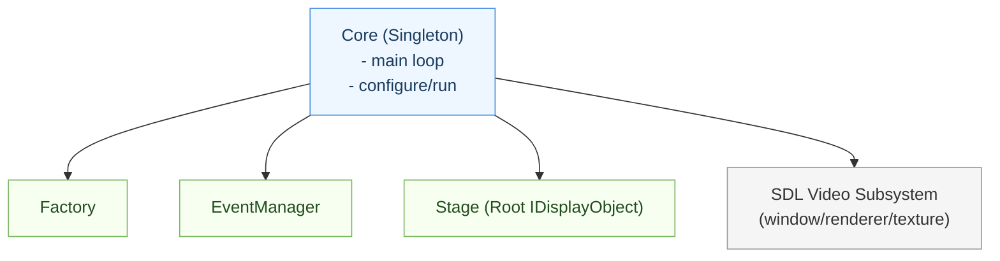
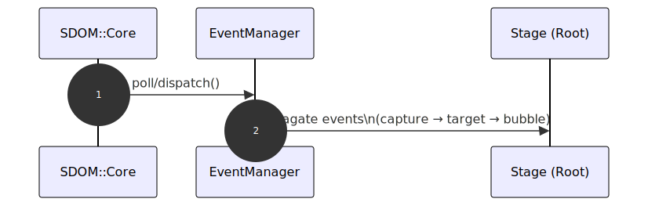
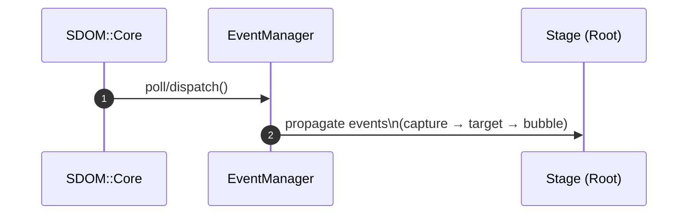

# Core Framework Design

See also: overall architecture diagram in docs/architecture_overview.md

## Overview
Core is the runtime orchestrator of SDOM. It bootstraps the SDL video subsystem (window, renderer, main texture), owns the main loop, and provides a single place to configure timing, presentation, and error handling. As a singleton, Core gives the application one stable entry point: you configure it up front, call run(), and it drives initialization, updates, event polling/dispatch, rendering, and shutdown in a predictable order.

Core coordinates the major subsystems that make up SDOM. It ensures types are registered with the Factory and creates the root Stage (the head of the display tree). Each frame, Core asks the EventManager to propagate input through capture → target → bubble phases across the display hierarchy, then invokes Stage::onUpdate(dt) and Stage::onRender(). By centralizing ownership of the window/renderer and delegating domain work to Stage, Factory, and EventManager, Core keeps responsibilities clean while maintaining tight control of the application lifecycle.

Core is designed for extensibility as well as simplicity. Applications can plug into lifecycle callbacks (init, update, event, render, quit), register hooks from other languages, and manage “scenes” by swapping the active Stage (changing the root of the DOM tree) without reinitializing the engine. Window resizing, presentation policy, and shutdown are handled centrally, while the Factory and typed handles decouple object creation and references from the objects’ lifetimes. The result is a compact core with clear extension points and a reliable runtime model.
For guidance on scripting and configuration (Lua-first via sol2), see [Scripting and Configuration](scripting_and_configuration.md) for recommended bindings, lifecycle hooks, and examples.

## Core Responsibilities
- Singleton pattern for global access and lifecycle management
- Main SDL loop management
- Error logging and trapping
- Composition and management of:
  - Factory (object/resource creation)
  - EventManager (event dispatch and handling)
  - Stage (the root display object)

## Core Initialization Sequence & Pre-Initialization Configuration

To ensure proper setup, `onInit()` should be called **after** the SDL Video Subsystem (window, renderer, texture) has been created and initialized. This requires that all necessary configuration parameters are provided to Core **before** initialization begins.

### Required Pre-Initialization Parameters:
- **Core (Pixel) Resolution:** The logical pixel dimensions for rendering.
- **Initial Window Size:** The starting size of the SDL window.
- **Rendering Flags:** SDL renderer creation flags (e.g., hardware acceleration, vsync).
- **Presentation Flags:** SDL window flags (e.g., resizable, fullscreen).
- **Color Format:** Desired pixel format for rendering and textures.
- **Other SDL/graphics options:** As needed for your application.

### Initialization Flow:
1. **Configure Core:**  
   Pass all required parameters to Core via a configuration struct or initialization method.
2. **Create SDL Video Subsystem:**  
   Core creates the SDL window, renderer, and main display texture using the provided settings.
3. **Call onInit():**  
   Once the video subsystem is ready, Core invokes `onInit()` to allow application-specific initialization (e.g., loading assets, setting up stages).
4. **Enter Main Loop:**  
   Core proceeds with the main SDL loop, event handling, and rendering.

### Example Configuration API:
```cpp
struct CoreConfig {
    float windowWidth;
    float windowHeight;
    float pixelWidth;   // Virtual width of a single pixel (for logical scaling; can be fractional/non-square)
    float pixelHeight;  // Virtual height of a single pixel (for logical scaling; can be fractional/non-square)
    bool preserveAspectRatio = true;    // Preserve original aspect ratio when resizing window
    bool allowTextureResize = true;     // Allow texture resolution to change when resizing window
    SDL_RendererLogicalPresentation rendererFlags;
    SDL_WindowFlags windowFlags;
    SDL_PixelFormat colorFormat;
    // ... other options ...
};

Core& core = getCore();
core.configure(CoreConfig{/* ... */});
core.run(); // Internally calls onInit() after SDL setup
```

**Note:**  
All pre-initialization information must be set before calling `run()` or starting the main loop. This ensures that the video subsystem is correctly configured and available for all subsequent operations.

---

### Alternative Initialization: Lua Configuration

SDOM uses Lua (via sol2) as the canonical configuration and scripting mechanism. Instead of JSON configuration, prefer Lua modules that return tables. Below is a minimal example showing a Lua configuration module and how C++ can load it with Sol2.

Example Lua module `config/core_config.lua`:

```lua
return {
  core = {
    windowWidth = 1280,
    windowHeight = 720,
    pixelWidth = 2.0,
    pixelHeight = 2.0,
    allowTextureResize = false,
    preserveAspectRatio = true,
    rendererFlags = "SDL_LOGICAL_PRESENTATION_LETTERBOX",
    windowFlags = "SDL_WINDOW_FULLSCREEN | SDL_WINDOW_RESIZABLE",
    colorFormat = "SDL_PIXELFORMAT_RGBA8888",
  }
}
```

Example C++ usage (Sol2):

```cpp
// Load configuration from Lua and hand it to Core
sol::state& lua = core.getLua();                      // obtain the Core-managed Lua state
sol::table cfg = lua.require<sol::table>("config.core_config");
core.configureFromLuaTable(cfg);                      // or core.configure(cfg);
core.run();
```

Migration note
- Convert JSON objects into Lua modules that return tables (arrays map to numeric-keyed tables; primitives map directly).
- For bulk conversions, a small script (Python/Node/Lua) that reads JSON and emits equivalent Lua table source is useful.
- If you must parse JSON at runtime instead of converting files, add a Lua JSON library to your application — SDOM does not bundle JSON parsing by default.

---

Let me know if you want this added to a specific section, or if you’d like to expand on configuration struct details or error handling for initialization!


## Primary Callbacks
The Core exposes the following virtual callback methods, which are invoked during the application lifecycle:

```cpp
virtual void  onQuit () override;
virtual void  onUpdate (float fElapsedTime) = 0;
virtual void  onEvent (const Event &event) = 0;
virtual void  onRender () = 0;
virtual bool  onUnitTest ();
```

- `onInit()`: Called during initialization.
- `onQuit()`: Called during shutdown/cleanup.
- `onUpdate(float fElapsedTime)`: Called every frame to update logic.
- `onEvent(const Event &event)`: Called for each incoming event.
- `onRender()`: Called every frame to render the stage.
- `onUnitTest()`: Called to run unit tests.

Each callback is designed to interact directly with the single Stage object, which represents the root of the display hierarchy.

## Hook & Callback Registration

To support extensibility across multiple languages (C++, Python, Rust, etc.), the Core framework provides a hook/callback registration system for all primary lifecycle and event methods. Instead of requiring inheritance, users can register function pointers, std::function, or language bindings for each event:

- Initialization: `registerOnInit(std::function<bool()>)`
- Quit: `registerOnQuit(std::function<void()>)`
- Update: `registerOnUpdate(std::function<void(float)>)`
- Event: `registerOnEvent(std::function<void(const Event&)>)`

- Render: `registerOnRender(std::function<void()>)`
- Unit Test: `registerOnUnitTest(std::function<bool()>)`

### Example (C++)
```cpp
Core core;
core.registerOnInit([]() { /* ... */ return true; });
core.registerOnQuit([]() { /* ... */ });
core.registerOnUpdate([](float dt) { /* ... */ });
core.registerOnEvent([](const Event& e) { /* ... */ });
core.registerOnRender([]() { /* ... */ });
core.registerOnUnitTest([]() { /* ... */ return true; });
```

### Example (Python/Rust)
Bindings can expose similar registration functions, allowing users to set hooks in their language of choice.
- Core stores each hook as a function object.
- At each lifecycle stage, Core checks for a registered hook and invokes it if present.
- Inheritance remains an option for C++ users, but is not required for other languages.

## Global Accessor Functions


The SDOM.hpp header may define a set of global functions within the SDOM namespace to provide convenient access to key framework components:
- `getCore()`
- `getStage()`
- `getWindow()`
- `getRenderer()`
- ...etc.

These global accessors allow users to retrieve singleton or shared instances of major subsystems without directly referencing their implementation details. This pattern simplifies initialization and integration, especially for scripting and cross-language bindings.

### Example Usage (with global accessor)
```cpp

Core& core = getCore();
core.registerOnInit([]() {
    // Custom initialization
    return true;
});
core.registerOnQuit([]() {
    // Cleanup logic
});
core.registerOnUpdate([](float dt) {
    // Game logic
});
core.registerOnEvent([](const Event &event) {
    // Handle events
});
core.registerOnRender([]() {
    // Render stage
});
core.registerOnUnitTest([]() {
    // Run tests
    return true;
});

int main() {
    core.run();

    return 0;
}
```

## Composition Diagram

SVG (static image):


<details>
<summary>View Mermaid source</summary>



</details>

## Event Flow

SVG (static image):


<details>
<summary>View Mermaid source</summary>



</details>

For details on propagation semantics, see `docs/dom_propagation.md`.

## Unit Tests

Core exposes `onUnitTest()` and can route tests through objects that implement `IUnitTest`. Typically, Factory-managed objects (including Stages or specific components) provide focused tests invoked via Core’s test hook.

## Stage

The Stage is the root `IDisplayObject`. It’s created via the Factory and orchestrated by Core. Child `IDisplayObject`s are attached under Stage; see also `docs/architecture_overview.md` for a full picture.

## SDOM Comprehensive Architecture Diagram

For the complete library-wide diagram, see `docs/architecture_overview.md`.

## SDOM Event System Integration

For event object shapes and propagation phases, see `docs/dom_propagation.md` and the Event/EventType API docs.

## Additional Interfaces and Utilities

- `IUnitTest`: lightweight interface for test hooks (see Unit Tests section).
- Handles: `DomHandle` and `ResHandle` provide safe references to Factory-owned objects (see `docs/object_handles.md`).

## Extensibility & Singleton Pattern

The Core object is implemented as a singleton, ensuring a single point of control for the application's lifecycle, event management, and resource handling. Despite the singleton pattern, SDOM remains highly extensible:

- Hooks, eventListeners, and class-based inheritance allow users to customize behavior without modifying the Core implementation.
- Plugins and modules can register their own callbacks or listeners with the singleton Core instance.
- The singleton ensures global access and coordination, while extensibility is achieved through registration APIs and listener patterns.

This design balances centralized control with flexible extension points for applications and language bindings.


## EventListener Support

In addition to direct hook/callback registration, the Core framework can support external integration through eventListeners. This approach allows users to attach listener objects or functions to specific lifecycle and event types, enabling modular and decoupled handling of application events.

- Listeners can subscribe to events such as Init, Quit, Update, Render, and custom events.
- The Core maintains a list of listeners for each event type and notifies them when the event occurs.
- Listeners can be implemented as objects with event-handling methods, or as standalone functions.

### Example (C)
```cpp
void onInit() { /* ... */ }
void onQuit() { /* ... */ }
void onUpdate(float dt) { /* ... */ }
void onEvent(const Event& e) { /* ... */ }
void onRender() { /* ... */ }

int main()
{
    Core& core = SDOM::getCore();
    CoreConfig config;
  config.windowWidth = 1280;
  config.windowHeight = 960;
  config.pixelWidth = 2.0;
  config.pixelHeight = 2.0;
  config.allowTextureResize = true;
  config.preserveAspectRatio = true;
  config.renderFlags = SDL_LOGICAL_PRESENTATION_LETTERBOX;
  config.windowFlags = SDL_WINDOW_FULLSCREEN | SDL_WINDOW_RESIZABLE;
  config.colorFormat = SDL_PIXELFORMAT_RGBA8888;
    core.configure(config);

    core.addEventListener(EventType::Init, []() { onInit(); });
    core.addEventListener(EventType::Quit, []() { onQuit(); });
    core.addEventListener(EventType::Update, [](float dt) { onUpdate(dt); });
    core.addEventListener(EventType::Event, [](const Event& e) { onEvent(e); });
    core.addEventListener(EventType::Render, []() { onRender(); });

    core.run();
}
```

### Benefits
- Enables multiple listeners for the same event type
- Decouples event handling from the Core and main application logic
- Facilitates plugin architectures and modular extensions

## Registering Custom Stage Objects

Custom Stage objects can be registered and managed through the Factory system, just like any other DOM object. To use a custom Stage:

1. **Inherit from the Stage class to define your custom Stage type.**
2. **Register the custom Stage type with the Factory.**
3. **Create the Stage instance via the Factory.**
4. **Register the Stage with the Core using a unique name.**
5. **Switch to the custom Stage using `Core::setStage(name)`.**

This approach ensures consistent resource management and makes it easy to extend SDOM with new scene types or behaviors.

### Example
```cpp
// Register custom Stage type with Factory
factory->registerType<CustomStage>("CustomStage");

// Create a custom Stage instance
resource_ptr<Stage> myStage = factory->create<CustomStage>(initStruct);

// Register the Stage with Core
core.registerStage("myCustomStage", myStage);

// Switch to the custom Stage
core.setStage("myCustomStage");
```

## Integration Methods Summary

SDOM Core supports three primary methods for application setup and event handling:

1. **Callback/Hook Registration**
   - Use `registerOnInit()`, `registerOnQuit()`, etc. to set function hooks for lifecycle and event methods.
   - Ideal for scripting languages, functional programming, and dynamic runtime configuration.

2. **EventListener Pattern**
   - Attach listener objects or functions to specific event types using `addEventListener()`.
   - Enables modular, decoupled event handling and plugin architectures.
   - Supports multiple listeners per event.

3. **Class-Based Inheritance**
   - Inherit from the Stage class and override virtual methods (`onInit()`, `onUpdate()`, etc.).
   - Familiar to C++ developers and suitable for static, strongly-typed applications.

### Flexibility & Use Cases
- Callback registration is best for cross-language bindings and dynamic configuration.
- EventListeners are ideal for extensible, plugin-based systems.
- Class-based inheritance provides a traditional OOP approach for C++ and similar languages.

Applications can mix and match these methods as needed, ensuring SDOM remains flexible and accessible to a wide range of development styles and languages.

## Performance Considerations

- The difference in performance between the three setup types (callback registration, eventListeners, class-based inheritance) is generally negligible for most applications.
- **Direct callback/hook registration** is likely the fastest, as it involves a single function call per event and is well-suited for functional programming or C language bindings.
- **EventListener pattern** may introduce minor overhead if there are many listeners attached to the same event, as each must be iterated and invoked. This overhead is typically small unless the listener count is very high.
- **Class-based inheritance** performance is similar to direct callbacks, as virtual method dispatch is efficient in modern C++ compilers.

For most use cases, the choice should be based on flexibility, language integration, and architectural needs rather than raw performance.

## Single Stage, Single Window Rationale

A previous iteration of the SDOM API supported multiple windows and stages, but this introduced significant complexity:
- Each window/stage required separate initialization of external resources (bitmaps, fonts, etc).
- Window placement is unreliable or unsupported on many OSes (e.g., Wayland, Windows).
- Managing multiple renderers and resource lifetimes increases maintenance burden.

For these reasons, SDOM now uses a single stage, single window framework. SDL window/renderer/texture management is encapsulated within the Core object, ensuring centralized control and simplified resource management.

## Overriding the Default Stage

If a user defines multiple Stage objects or wishes to override the default stage:
- The Core should maintain a single active Stage instance at any time.
- When a new Stage is set, the previous (default) Stage should be destroyed or dereferenced, and all rendering/event logic should be redirected to the new Stage.
- The API should provide a method such as `setStage(Stage*)` or `replaceStage(Stage*)` to handle this transition cleanly.
- Only one Stage should be active and connected to the window/renderer at a time; additional Stage objects should remain inactive until explicitly set as the current stage.

This approach maintains the simplicity and reliability of the single stage/single window model, while allowing advanced users to swap or override the Stage if needed.

## Multiple Stages as Scenes

SDOM can support multiple Stage objects, but only one Stage is active at any given time. This enables a flexible scene management system:
- Each Stage instance can represent a different "Scene" (e.g., menu, gameplay, pause screen).
- The Core maintains a reference to the currently active Stage.
- Users can create, store, and switch between Stage objects using an API such as `setActiveStage(Stage*)` or `activateScene(Stage*)`.
- When a new Stage is activated, the previous Stage is deactivated (but not destroyed), allowing for fast scene transitions and state preservation.
- All rendering, event handling, and updates are directed to the active Stage.

This approach combines the simplicity of a single window with the flexibility of multi-scene applications, making SDOM suitable for games, interactive apps, and complex UIs.


## Window Resizing & Texture Resolution

Window resizing introduces several design considerations, especially when supporting multiple stages or scenes with their own textures and renderers:

- **Texture Resolution Adjustment:**  
  When the window is resized, you can choose to:
  - Dynamically recreate the render target texture to match the new window size (may require reloading or scaling assets).
  - Keep the texture resolution fixed and scale/stretch the rendered output to fit the window.

- **Rendering Strategies:**  
  - **Stretch:** Scale the rendered texture to fill the window, which may distort aspect ratio.
  - **Letterbox/Pillarbox:** Maintain aspect ratio by adding black bars (letterboxing) if the window size does not match the texture resolution.
  - **Dynamic Layout:** Adjust DOM display objects and UI layout to fit the new window size, which may require recalculating positions and sizes.

- **Complexity with Multiple Stages:**  
  If each Stage has its own texture and renderer, resizing the window means:
  - The active Stage must update its renderer and texture to match the new window size.
  - Inactive Stages may need to store their preferred resolution and update when activated.
  - DOM display objects must be aware of the current renderer and texture, and may need to adjust their layout or assets accordingly.

- **Recommended Approach:**  
  - Compose the SDL Video Subsystem within the Core object for centralized management.
  - Provide hooks/callbacks (e.g., `onWindowResize(int width, int height)`) for Stages and DOM objects to respond to window size changes.
  - Decide on a default rendering strategy (stretch, letterbox, dynamic layout) and allow applications to override as needed.
  - Document the implications of window resizing for asset management, texture recreation, and UI layout.

This approach balances centralized control with flexibility, ensuring that window resizing is handled consistently and efficiently across all stages and display objects.

## Shared Display Texture for Stages

While SDOM supports multiple Stage objects for scene management, it is not necessary for each Stage to maintain its own main display texture. If all Stages share the same pixel dimensions as the main display managed by Core, they can simply use the same CoreTexture for rendering.

- This approach reduces memory usage and simplifies resource management.
- All Stages render to the same texture, ensuring consistent output and easy scene transitions.
- If a Stage requires offscreen rendering or special effects, it can create its own auxiliary textures as needed, but the main display texture remains shared.

By default, SDOM encourages sharing the CoreTexture among all Stages unless an application has specific requirements for unique render targets per scene.

## Stages as Game States or Modes

Supporting multiple Stage objects in SDOM enables the framework to represent different states or modes within an application or game. For example:

- **Main Menu Stage:** Handles menu navigation, UI, and input for starting or exiting the game.
- **Settings Stage:** Manages configuration options, audio/video settings, and user preferences.
- **Gameplay Stage:** Contains the main game logic, rendering, and event handling for active play.
- **Pause Stage:** Displays pause menu, overlays, or temporary dialogs during gameplay.

Each Stage encapsulates its own display hierarchy, event handling, and logic, allowing for clean separation of concerns and easy transitions between states. The Core manages which Stage is currently active, enabling fast and reliable switching between modes.

This design makes SDOM well-suited for games and interactive applications that require multiple distinct states or scenes.

## Changing the Active Stage

SDOM provides a simple API for switching the active Stage (scene) by name:

```cpp
Core::setStage(std::string name);
```

- This call sets the Stage identified by its unique name as the active scene.
- All rendering, event handling, and updates are redirected to the newly activated Stage.
- The previous Stage is deactivated but remains available for future use or state preservation.
- This approach enables fast and reliable scene transitions, making it easy to implement menus, gameplay, settings, and other modes.

Example usage:
```cpp
Core& core = SDOM::getCore();
core.setStage("gameplay"); // Switch to the gameplay scene
```

This API keeps scene management simple and intuitive for developers.


---
This document will be expanded as the SDOM Core framework evolves.
