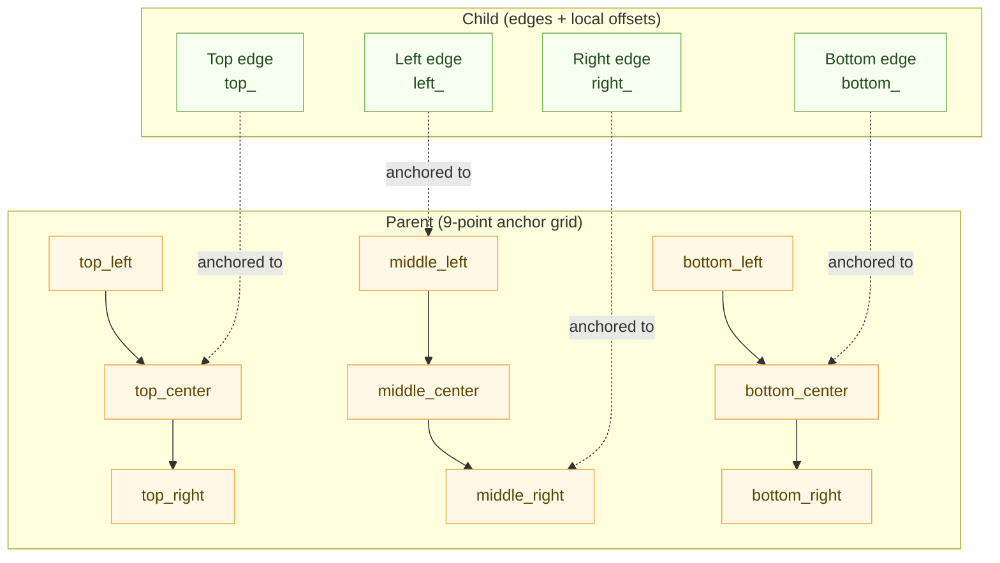
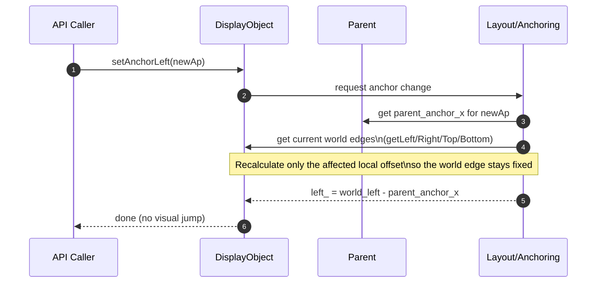

## Display Object Anchoring System 
(Updated September 2, 2025)

The Display Object Anchoring System defines layout in SDOM by anchoring each of a child’s four edges to any of nine reference points on its parent (top/middle/bottom × left/center/right). Each edge has its own anchor and local offset (left_, right_, top_, bottom_), so objects can pin, center, or stretch asymmetrically as parents move or resize. World-space geometry is derived from edges—width = right − left and height = bottom − top—yielding predictable, resolution‑independent layout.

When anchors change, the system preserves visual stability. Changing an anchor recalculates only the corresponding local offset so the world position of that edge does not move. The same invariant powers drag‑and‑drop and reparenting: record the world edges, apply the new parent/anchors, then resolve new local offsets from the new parent’s anchor references. This makes interactive editing and runtime scene changes smooth, enabling fixed margins, edge‑to‑edge stretching, and center‑based alignment without jumps.

The API exposes clear accessors for per‑edge anchors and offsets, with sensible defaults that keep existing content working (top‑left if unspecified). Configuration can be supplied in code, via Lua scripts during initialization or at runtime, or from external data; names map directly onto the nine‑point grid with convenient aliases. Because anchoring is edge‑based and hierarchical, complex layouts compose naturally: nested children inherit motion from ancestors yet retain precise rules for how each edge follows the parent. The result is a compact, robust model that behaves well under resizing, scaling, and scene swaps.


### Anchor Naming Conventions
- Anchor points are represented as enums in code: `AnchorPoint::TOP_LEFT`, `AnchorPoint::TOP_CENTER`, `AnchorPoint::TOP_RIGHT`, `AnchorPoint::MIDDLE_LEFT`, `AnchorPoint::MIDDLE_CENTER`, `AnchorPoint::MIDDLE_RIGHT`, `AnchorPoint::BOTTOM_LEFT`, `AnchorPoint::BOTTOM_CENTER`, `AnchorPoint::BOTTOM_RIGHT`.
- In Lua or config, these may be written as strings: `"top_left"`, `"middle_center"`, etc. The mapping is direct and bindings accept either the enum or a string alias.

### Edge-Based Layout
- Each display object tracks its edges: `left_`, `right_`, `top_`, `bottom_`.
- Each edge can have its own anchor point, allowing for asymmetric anchoring.
- All movement, resizing, and anchor changes are performed via edge setters/getters: `setLeft`, `setRight`, `setTop`, `setBottom`, `getLeft`, `getRight`, `getTop`, `getBottom`.

### Position and Size Calculation
- The world position of each edge is calculated as:
    - `getLeft() = parent_anchor_x + left_`
    - `getRight() = parent_anchor_x + right_`
    - `getTop() = parent_anchor_y + top_`
    - `getBottom() = parent_anchor_y + bottom_`
    - Where `parent_anchor_x` and `parent_anchor_y` are determined by the parent's anchor reference for the respective edge.
- **Width and height are always computed as:**
    - `width = getRight() - getLeft()`
    - `height = getBottom() - getTop()`

### Anchor Accessors/Mutators
- Use the following API methods for anchor management:
    - `setAnchorLeft(AnchorPoint ap)`
    - `setAnchorRight(AnchorPoint ap)`
    - `setAnchorTop(AnchorPoint ap)`
    - `setAnchorBottom(AnchorPoint ap)`
    - `getAnchorLeft()`, `getAnchorRight()`, `getAnchorTop()`, `getAnchorBottom()`

### Changing Anchor Points
- When an anchor is changed, the corresponding local offset (`left_`, `right_`, etc.) is recalculated so the world position of the edge does not move.
- Only the local offset for the changed anchor is updated; other edges remain unchanged unless their anchors are also changed.

### Drag-and-Drop and Reparenting
- **When reparenting or during drag-and-drop:**
    - Record the world positions of all edges (`getLeft()`, `getRight()`, `getTop()`, `getBottom()`) before changing parent or anchor.
    - After changing parent or anchor, recalculate all local offsets using the new parent's anchor references and the recorded world positions.
- This ensures the object's position and size remain correct regardless of anchor configuration or parent changes.

### Summary
- The anchoring system is now robust, edge-based, and supports asymmetric anchors.
- All geometry calculations and API methods have been updated to reflect this design.
## Overview
This document describes the anchor point system for positioning and sizing display objects in the SDOM API. Anchoring enables flexible, responsive layouts by allowing each display object to reference its position and size to any of nine anchor points on its parent.

## Anchor Points
Each display object can specify anchor points for its four edges (left/X, top/Y, right/width, bottom/height) in relation to its parent. The nine possible anchor points are:

- `top_left`
- `top_center`
- `top_right`
- `middle_left`
- `middle_center`
- `middle_right`
- `bottom_left`
- `bottom_center`
- `bottom_right`

### Reversed versions for user convenience
- `center_middle`
- `right_middle`
- `left_middle`
- `center_top`
- `right_top`
- `left_top`
- `center_bottom`
- `right_bottom`
- `left_bottom`

For convenience, aliases like `left`, `center`, `right`, `top`, `middle`, and `bottom` are also supported.

## Lua Interface
Anchor points are typically provided from Lua modules or from code. For configuration files, prefer a small Lua module that returns a table. If anchor fields are omitted, anchors default to `top_left`.

Example Lua module (`config/layout.lua`):

```lua
return {
    x = 10,
    y = 10,
    width = -10,
    height = -10,
    child_anchor_x = "left",
    child_anchor_width = "right",
    child_anchor_y = "top",
    child_anchor_height = "bottom",
}
```

C++ (Sol2) usage to load the module and configure an object:

```cpp
sol::state& lua = core.getLua();
sol::table cfg = lua.require<sol::table>("config.layout");
auto childAnchorX = cfg["child_anchor_x"].get_or<std::string>("top_left");
AnchorPoint ap = parseAnchor(childAnchorX);
child->setAnchorLeft(ap);
```

## Position and Size Calculation
- **X (left edge):** Anchored to the specified parent anchor point, plus offset.
- **Y (top edge):** Anchored to the specified parent anchor point, plus offset.
- **Width (right edge):** Anchored to the specified parent anchor point, minus offset.
- **Height (bottom edge):** Anchored to the specified parent anchor point, minus offset.

For example:
```
child.x = parent.anchor_x + offset_x
child.y = parent.anchor_y + offset_y
child.width = parent.anchor_width - offset_width
child.height = parent.anchor_height - offset_height
```

## Changing Anchor Points
When an anchor point is changed, the offset is recalculated so the display object remains visually in the same position and size. This ensures a smooth user experience and prevents layout jumps.

## Hierarchical Anchoring
Anchor calculations are recursive: each display object references its parent, which may itself be anchored to its own parent, up to the stage. This enables complex, nested layouts.

## Backward Compatibility & Migration
Existing code that sets anchors programmatically remains compatible. Configuration files that used JSON should be converted to Lua modules (small one-to-one mappings) — see the Migration note below.

## Benefits
- Flexible, responsive layouts
- Easy margin and stretching logic
- Consistent positioning and sizing
- Backward compatibility

## Example Use Cases
- Center a child object within its parent
- Stretch a child object with margins as the parent resizes
- Align a child to any edge or corner of its parent


---

This anchor system makes SDOM display objects highly flexible and professional, supporting modern UI layout needs.

---

## Anchoring Diagrams

### 1) Parent Anchor Grid and Child Edge Anchors


</details>

Key idea: each edge uses its own parent anchor reference plus a local offset; width/height derive from right-left and bottom-top.

### 2) Anchor Change Recalculation (No Visual Jump)



</details>

This flow illustrates the invariant maintained during anchor changes: the world edge position remains the same while only the corresponding local offset is updated.

## Anchor helpers & parsing
Bindings accept both enumerated values and string names. A small C++ helper simplifies mapping user-facing strings to enums; expose this to Lua so scripts can use readable names.

```cpp
// simple mapping helper
AnchorPoint parseAnchor(const std::string &s) {
    static const std::unordered_map<std::string, AnchorPoint> map = {
        {"top_left", AnchorPoint::TOP_LEFT}, {"left_top", AnchorPoint::TOP_LEFT}, {"left", AnchorPoint::TOP_LEFT},
        {"top_center", AnchorPoint::TOP_CENTER}, {"center_top", AnchorPoint::TOP_CENTER}, {"center", AnchorPoint::TOP_CENTER},
        {"top_right", AnchorPoint::TOP_RIGHT}, {"right_top", AnchorPoint::TOP_RIGHT}, {"right", AnchorPoint::TOP_RIGHT},
        {"middle_left", AnchorPoint::MIDDLE_LEFT}, {"left_middle", AnchorPoint::MIDDLE_LEFT},
        {"middle_center", AnchorPoint::MIDDLE_CENTER}, {"center_middle", AnchorPoint::MIDDLE_CENTER},
        {"middle_right", AnchorPoint::MIDDLE_RIGHT}, {"right_middle", AnchorPoint::MIDDLE_RIGHT},
        {"bottom_left", AnchorPoint::BOTTOM_LEFT}, {"left_bottom", AnchorPoint::BOTTOM_LEFT},
        {"bottom_center", AnchorPoint::BOTTOM_CENTER}, {"center_bottom", AnchorPoint::BOTTOM_CENTER},
        {"bottom_right", AnchorPoint::BOTTOM_RIGHT}, {"right_bottom", AnchorPoint::BOTTOM_RIGHT}
    };
    auto it = map.find(s);
    return it != map.end() ? it->second : AnchorPoint::TOP_LEFT;
}
```

Expose `parseAnchor` to Lua via your usual binding so scripts can call `parseAnchor("left")` or pass strings directly where supported.

## Migration note
- Convert JSON objects into Lua modules that return tables (arrays → numeric-keyed tables; primitives map directly).
- Example JSON `{ "child_anchor_x": "left" }` maps to Lua `child_anchor_x = "left"` in a module that returns a table.
- For bulk conversions, a short script (Python/Node/Lua) that reads JSON and writes `.lua` modules is helpful. If runtime JSON parsing is required, add a Lua JSON library to your project — SDOM does not bundle one by default.