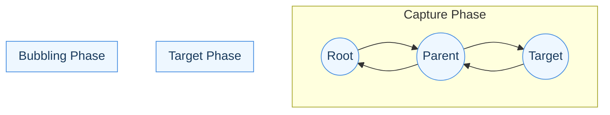

# DOM Propagation Design

## Overview

In SDOM, the Document Object Model (DOM) is a hierarchical tree structure representing all displayable and interactive elements in the system. Each element in the tree is called a node or object, and may have parent/child relationships with other nodes. Nodes can represent UI components, containers, or other resources.

DOM trees are inherently recursive: each node may contain children, and traversal algorithms typically use recursion to visit every node in the hierarchy. Because of this recursive nature, modifying the tree (such as adding or removing nodes) while it is being traversed can disrupt the traversal process. Changes made mid-recursion can invalidate pointers, break parent/child relationships, or cause traversal algorithms to miss nodes or revisit them incorrectly. In the worst case, this can lead to segmentation faults or other critical errors if the recursion encounters a node that has been deleted or moved unexpectedly.

Propagation refers to the process by which changes, events, or updates move through the DOM tree. This includes traversing the tree for rendering, layout, and event delivery (such as mouse clicks or keyboard input). Propagation ensures that updates and events reach the appropriate nodes in the correct order.

To prevent these issues, SDOM defers add/remove actions during traversal, applying them only after traversal completes. Outside of traversal (such as during initialization or setup), nodes can be added or removed immediately, allowing real-time construction and adjustment of the DOM tree.

This document outlines the four main types of DOM traversal and propagation strategies used in SDOM, their responsibilities, and where they are implemented in the architecture.

---

## Event Propagation Diagram



</details>

## Traversal Types

### 1. Core-based DOM Traversal (Type 1)

- **Purpose:** Rendering, updating, and layout of the active DOM tree.
- **Implementation:**  
  - Managed by the `Core` object.
  - Uses recursive lambdas for traversal, rather than having each node call its own children.
  - Only traverses nodes that are active, visible, and enabled.
  - Nodes in different trees or disabled branches are skipped.
  - Does **not** guarantee that all DOM objects will be traversed.

---

### 2. EventManager-based Event Traversal (Type 2)

- **Purpose:** Event propagation (bubbling/capturing) through the DOM tree.
- **Implementation:**  
  - Managed by the `EventManager` (planned, reference code exists).
  - Traverses the DOM tree similarly to display traversal, but for event delivery.
  - Propagation stops at disabled nodes or when an event is consumed.
  - Only traverses the active DOM tree.

---

### 3. Factory-based Global Traversal (Type 3)

- **Purpose:** Operations on all resources, regardless of DOM structure (e.g., shutdown, global events).
- **Implementation:**  
  - Managed by the `Factory`.
  - Iterates through all `IResourceObject` instances in the Factory’s internal container.
  - Used for global operations such as calling `onQuit()` on every resource or handling global events.
  - Ignores parent/child relationships and node state.

### 4. World Coordinate Backpropagation Traversal (Type 4)

- **Purpose:** Calculating each node's world coordinates based on its hierarchical position and anchor relationships within the DOM tree.
- **Implementation:**  
  - Each node has four edges (left, top, right, bottom), and each edge can be anchored to one of nine reference points on its parent (see AnchorPoint enum).
  - Type 4 traversal recursively walks up the DOM tree from a node to its ancestors, backpropagating anchor relationships to compute the node's absolute world coordinates.
  - This process ensures that every node's position and size are accurately determined in relation to its parent and the overall DOM hierarchy.
  - Modifying the tree during this traversal can disrupt coordinate calculations, so changes should be deferred until traversal completes.
  

## Traversal Safety and Modification

To ensure safe modification of the DOM tree during traversal, all three traversal types (Core, EventManager, Factory) should set an `isTraversing` flag to `true` at the start of traversal and clear it when traversal ends.

- **Modification Blocking:**
  - While `isTraversing` is `true`, add/remove child operations must be blocked or deferred.
  - Deferred operations can be stored in a queue/list and processed after traversal completes.

- **Thread Safety:**
  - If multithreading is supported, use a mutex or lock to prevent other threads from modifying the DOM tree while traversal is active.
  - This ensures that no thread can add or remove children if the primary thread is traversing.

- **Type-specific Safety:**
  - Type 1 (Core) and Type 2 (EventManager) traversals require strict safety, as they affect display and event propagation.
  - Type 3 (Factory/global) traversals are less critical but should still respect the `isTraversing` flag for consistency.

This approach maintains the integrity of the DOM tree and event system, preventing undefined behavior and race conditions during traversal.

**Note on Initialization and Active Nodes:**
During initialization (such as building the DOM tree from Lua modules or manual setup), the `isTraversing` flag should be false, allowing immediate parent/child modifications. This enables real-time adjustment of relationships as nodes are created and attached, without waiting for a deferred update cycle.

However, when a node is active (i.e., it is the current target during DOM traversal or event handling), any add/remove child actions will be deferred until traversal completes. For example, if a `Button` object responds to a `MouseClick` event in its `Button::onEvent()` method, it can request add/remove actions on other nodes, but these changes will not take effect until the next update cycle after traversal ends.

The `onEvent()` method can poll the traversal state (e.g., via `Core::getIsTraversing()`) to determine whether changes will be immediate or deferred. This allows event handlers to request structural changes, knowing they will be safely applied after traversal, and that any new links or removals will only be reflected in the DOM tree on the next cycle.

### Deferred actions processing (pseudo)
When traversal completes, process the deferred queue with validation. Example pseudocode:

```cpp
// thread-safe deferred queue processing (single-consumer expected)
void processDeferred() {
  std::lock_guard<std::mutex> lk(deferredMutex);
  while (!deferredQueue.empty()) {
    auto req = std::move(deferredQueue.front());
    deferredQueue.pop();

    // Validate target and operation
    if (!isValid(req.target)) {
      DEBUG_LOG("Deferred request target invalid: " << req.describe());
      continue;
    }

    // Apply the change (add/remove/replace)
    applyRequest(req);
  }
}
```

Processing should run on the main thread immediately after traversal finishes (or at a deterministic point in the update loop). If an operation cannot be applied (target destroyed, invalid parent, etc.), log and skip the request rather than crashing.

### Thread-safety notes
- Use an atomic ``isTraversing`` or protect traversal state with a mutex when multiple threads may read/write this flag.
- Protect the deferred request queue with a mutex; prefer a single consumer (the main thread) to avoid complex synchronization.

Traversal safety checks only apply during active traversal phases (rendering, event propagation, etc.).

## Architectural Separation

- **Core**: Handles display/layout traversal (Type 1).
- **EventManager**: Handles event propagation traversal (Type 2).
- **Factory**: Handles global resource traversal (Type 3).

This separation ensures modularity, maintainability, and clarity in the codebase. Each traversal type can be extended or optimized independently.

## Migration note
If you previously used JSON to programmatically build a DOM (for example, exported from design tools), convert those configuration files into Lua modules that return tables. Lua modules are easier to compose, can contain helper logic, and integrate directly with the runtime Lua state.

Example JSON → Lua mapping:

JSON:
```json
{ "type": "Button", "x": 10, "y": 10 }
```

Lua module:
```lua
return { type = "Button", x = 10, y = 10 }
```

For bulk conversions, a small script to read JSON and write `.lua` files is recommended; alternatively, add a Lua JSON library to your runtime if you must parse JSON at runtime.


**Note on Deferred Request Validation (Future Consideration):**
When processing deferred add/remove actions after traversal, each request should be validated to ensure the target node is still valid and available. If a requested action cannot be performed (e.g., the target node is destroyed or missing), log an error or warning for debugging, and consider notifying the requesting node so it can handle the failure gracefully. This helps prevent inconsistent DOM states and improves robustness. Further strategies for error handling and notification may be considered in future revisions.

