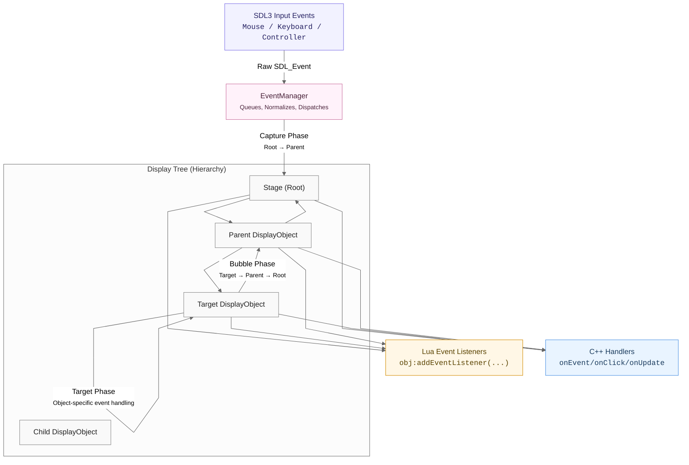
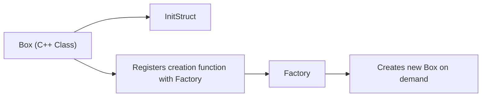

# Extensible Factory Design

The Factory is where SDOM creates things. Whenever the system needs a new display object (like a Button, Slider, or Label) or a new resource (like a texture or font), it asks the Factory to build it. This keeps object creation consistent and centralized, instead of scattering `new` calls throughout the codebase.

One important detail is that the Factory does **not** return raw pointers. Instead, it returns **DisplayHandles** and **AssetHandles**. These are lightweight, copyable references that stay valid even if the underlying object gets moved in memory or reloaded. Handles also make it possible for Lua, C++, or even other languages in the future to reference the same objects safely.

Objects themselves live in the Factory’s internal registry, and they stay alive as long as something is using them. When an object is removed from the visual tree, it becomes an **orphan**. Depending on the object’s configured retention policy, the Factory can keep it around, destroy it immediately, or allow it to exist for a **grace period** (useful for animated UI transitions).

This design lets SDOM behave more like a scene graph or UI toolkit rather than a typical “immediate mode” renderer. Each element can have a lifetime, identity, name, and state that persists across frames — which is essential for building responsive, stateful interfaces.

For an overview of how the Factory relates to Core, Stage, EventManager, and the display tree, see:  
`docs/architecture_overview.md`.

---

### **Lua Is Optional (but First-Class)**

SDOM can be used in several ways:

- **No Lua at all:** Create everything directly from C++.
- **Lua for configuration only:** Define UI layout in Lua; keep logic in C++.
- **Lua + C++ together:** Hybrid scripting and native logic.
- **Lua only:** Build applications entirely in Lua, with rendering and layout handled in optimized C++.

The same handle-based architecture will also support **bindings for other languages** such as Rust and Python. The goal is to make SDOM useful as both:

- A **high-performance UI engine**, and
- A **portable scripting-friendly application framework**.

---

So when we talk about the Factory, we are really talking about the heart of SDOM:  
**the system that defines how objects are created, named, referenced, and eventually released.**

The rest of this document explains how the Factory is structured, how lifetime rules work, and how to register new object and asset types.

# Lua Application Framework (Test + Runtime Layer)

SDOM embeds Lua not just for configuration, but also as an optional application
logic layer. You may choose how much of your project uses Lua:

| Use Case | Description |
|---------|-------------|
| **No Lua** | Create and control the UI entirely from C++. |
| **Lua Configuration** | Use Lua only to describe UI layout. |
| **Mixed Logic** | Use Lua for UI logic and C++ for core systems. |
| **Full Lua App** | Write your entire project in Lua; SDOM handles rendering and events. |

The file `lua/config.lua` acts as the *application entry point* when running
the example test application:

```lua
Core.run("lua/config.lua")
```
This file returns a config table describing initial resources, window
settings, and the root display tree. SDOM reads this table and builds the scene
graph via the Factory.

### Callback Modules
Rather than placing logic directly inside config.lua, callbacks are organized
into modules under:
```csharp
lua/callbacks/
    init.lua
    quit.lua
    update.lua
    event.lua
    render.lua
    unittest.lua
    window_resize.lua
```
Each module returns a table of functions. These functions are registered with
the engine using `registerOn(name, fn):`
```lua
registerOn("Init", callbacks.init.on_init)
registerOn("Update", callbacks.update.on_update)
registerOn("Render", callbacks.render.on_render)
```
This keeps application logic clean, testable, and modular.

### Display Object Event Listeners
Display objects can listen for UI events directly:
```lua
local button = getDisplayObject("main_stage_button")

button:addEventListener({
    type = EventType.MouseClick,
    listener = function(ev)
        setRoot("stageTwo")
    end
})
```
Listeners are stored inside the object and participate in full event dispatch:
capture → target → bubble.

These listeners may receive structured SDOM event payloads. In the future,
a unified payload schema will ensure consistent fields for keyboard, mouse,
window, drag, and custom UI events.

### Larger Applications
This structure scales cleanly:
- UI layouts defined as trees
- Behavior defined in small listener and callback modules
- State transitions implemented by changing the active Stage (`setRoot("X")`)

---

## Now, One More Step:

### Lua flows naturally into the core systems:
Lua config → Factory → Display Tree → Event System → Lua callbacks

<div class="mermaid">
%%{init: { "theme": "neutral", "flowchart": { "curve": "linear" } }}%%
flowchart LR

    %% Classes
    classDef lua fill:#fff7e6,stroke:#d28b00,color:#5a4300,stroke-width:1px
    classDef core fill:#e9f4ff,stroke:#4a90e2,color:#1a3b5d,stroke-width:1px
    classDef factory fill:#f0fff4,stroke:#5fa862,color:#1b4220,stroke-width:1px
    classDef display fill:#f9f9f9,stroke:#888,color:#222,stroke-width:1px
    classDef event fill:#fff2fa,stroke:#ca6f9e,color:#431a33,stroke-width:1px
    classDef external fill:#f2f2ff,stroke:#7c6fe6,color:#262262,stroke-width:1px

    %% Nodes
    LuaConfig["Lua Config Table<br/><code>config = { ... }</code>"]:::lua
    Callbacks["Lua Callback Modules<br/><code>callbacks/*.lua</code>"]:::lua

    Core["Core SDL Window + Main Loop"]:::core
    Factory["Factory Creates & Owns Objects"]:::factory
    Resources["Resource Registry (TTF, Images, Sprites, etc.)"]:::factory
    DisplayTree["Display Tree (IDisplayObject hierarchy)"]:::display

    EventMgr["EventManager (Capture → Target → Bubble)"]:::event
    LuaEventListeners["Lua Object Listeners<br/><code>obj:addEventListener(...)</code>"]:::lua

    SDL3["SDL3 / Platform Input"]:::external

    %% Relationships
    LuaConfig --> Core
    Core --> Factory
    Factory --> Resources
    Factory --> DisplayTree

    Core --> EventMgr
    EventMgr --> DisplayTree
    DisplayTree --> LuaEventListeners

    Callbacks --> Core
    Callbacks --> DisplayTree
    Callbacks --> LuaEventListeners

    SDL3 --> EventMgr
    EventMgr --> LuaEventListeners
</div>


### ✅ What this Diagram Communicates
This visual shows:
- Lua starts everything by defining the config table.
- Core reads that configuration and sets up the system.
- The Factory constructs resources and display objects.
- The Display Tree represents UI layout, hierarchy, and transforms.
- EventManager receives raw SDL3 input → dispatches structured events.
- Lua event listeners receive high-level UI events (not raw SDL fields).
- Lua callback modules handle update/render/global behavior.

### This directly reinforces:
| Layer          | Responsibility                                           |
| -------------- | -------------------------------------------------------- |
| **C++ Engine** | Rendering, object lifetime, event dispatch, performance. |
| **Lua**        | Application behavior, UI logic, orchestration.           |
| **Handles**    | Safe, language-independent references.                   |
| **Factory**    | Centralized object creation + ownership.                 |


🧠 What This Shows
| Phase       | Path                 | Purpose                                  |
| ----------- | -------------------- | ---------------------------------------- |
| **Capture** | Root → Target parent | "See what's about to happen."            |
| **Target**  | Target only          | The object receiving the event reacts.   |
| **Bubble**  | Target → Root        | Higher-level systems react after target. |


--- 

# How a Display Object Registers Itself with the Factory

In SDOM, display objects are not created by calling constructors directly.  
Instead, each display object **registers itself** with the Factory, and the Factory becomes the only place that creates them.

This gives us three major benefits:

1. **Consistent object creation** (one system controls lifetimes and references)
2. **Lua and C++ can create the same objects using the same rules**
3. **Objects can be extended or added without modifying engine code**

---

### The Core Idea

Each display object type (such as `Box`, `Label`, or `Button`) provides:

| Requirement | Purpose |
|------------|---------|
| An **InitStruct** | Holds initial values such as position, size, name, etc. |
| A **constructor that accepts the InitStruct** | Allows deterministic creation via Factory. |
| A **registration call** | Tells the Factory how to build this object when requested. |

Once registered, the type can be created using:

```cpp
auto box = Core::getFactory().create("Box", initStruct);
```
Or fromLua:
```lua
Core:createDisplayObject("Box", { name="myBox", x=50, y=50 })
```
No duplication. Same system, two languages.

---
## Visual Model: Where Registration Lives

---
## A Minimal Example
Let's say we are adding a new display object called `MyWidget`.

1. Define its `InitStruct`:
```cpp
  struct InitStruct : public IDisplayObject::InitStruct {
      int someValue = 0;
  };
```
2. Implement the Class Constructor:
```cpp
MyWidget::MyWidget(const InitStruct& init)
: IDisplayObject(init)
{
    someValue_ = init.someValue;
}
```
3. Register with the Factory:
```cpp
bool MyWidget::registerWithFactory(Factory& f) {
    return f.registerDisplayObjectType<MyWidget, MyWidget::InitStruct>("MyWidget");
}
```
The Factory now knows:
- The **name**: `MyWidget`
- The **InitStruct** to expect
- The **constructor** to call

---

### What Registration Actually Looks Like Inside the Factory
The Factory keeps a table:
```bash
"typeName" → creation function
```
So for `"MyWidget"`, it stores something equivalent to:
```cpp
factory.creators_["MyWidget"] = [](const InitStruct& init) {
    return std::make_unique<MyWidget>(init);
};
```
--- 
## Creating a New Display Object Type

When adding a new display object to SDOM, there are a few moving parts — but each one has a clear purpose.  
Let’s walk through the pattern using `Stage` as an example, because `Stage` shows the full structure cleanly.

Every display object type must:

1. Inherit from **IDisplayObject** (or another SDOM object that inherits from it)
2. Define an **InitStruct** that sets default values and custom properties
3. Provide **protected constructors** (so only the Factory can create it)
4. Provide **static CreateFromLua / CreateFromInitStruct callbacks**
5. Implement lifecycle methods (`onInit`, `onRender`, etc.)
6. Register its **Lua bindings**, calling the parent first

Once this is done, the object can be created from both C++ and Lua **without changing the Factory**.

---

### 1. Class Declaration

```cpp
class Stage : public IDisplayObject {
    using SUPER = IDisplayObject;

public:
    static constexpr const char* TypeName = "Stage";

    struct InitStruct : public IDisplayObject::InitStruct {
        InitStruct() {
            name = TypeName;
            type = TypeName;
            color = {0, 0, 0, 255};
            // example custom property:
            // bool enableSomething = true;
        }
    };

protected:
    Stage(const InitStruct& init);
    Stage(const sol::table& config);
    Stage(const sol::table& config, const InitStruct& defaults);

public:
    static std::unique_ptr<IDisplayObject> CreateFromLua(const sol::table& config) {
        return std::unique_ptr<IDisplayObject>(new Stage(config));
    }
    static std::unique_ptr<IDisplayObject> CreateFromInitStruct(const IDisplayObject::InitStruct& baseInit) {
        return std::unique_ptr<IDisplayObject>(new Stage(static_cast<const Stage::InitStruct&>(baseInit)));
    }

    virtual ~Stage() = default;

    // Object lifecycle and rendering
    virtual bool onInit() override;
    virtual void onQuit() override;
    virtual void onUpdate(float dt) override;
    virtual void onEvent(const Event& event) override;
    virtual void onRender() override;
    virtual bool onUnitTest() override;

protected:
    virtual void _registerLuaBindings(const std::string& typeName, sol::state_view lua);
    sol::usertype<Stage> objHandleType_;
};
```
---
### 1. Why These Pieces Exist
| Code Element | Purpose |
|--------------|---------|
| `SUPER = IDisplayObject` | Gives easy access to the base class (we’ll use this soon). |
| `static constexpr const char* TypeName` | The global identity of the object type. Used by C++, Lua, Factory, debugging, etc.|
| `InitStruct` | Defines default values and new custom properties your object adds. |
| `Protected Constructors` | Ensures objects can **only be created by the Factory**, never by accident. |
| `CreateFromInitStruct` | These are the hooks the Factory calls to actually construct your object. |
| `Lifecycle overrides` | Allow your object to draw, update, handle input, etc. |
| `_registerLuaBindings()` | Connects your object to Lua, tools, and scripting. |

---

### 2. Lua Binding (Important Detail!)
Here is the `critical rule` when registering Lua bindings:
> Always call the base class binding function first.
> This ensures your object inherits all the Lua features of its parent.

```cpp
void Stage::_registerLuaBindings(const std::string& typeName, sol::state_view lua) {
    // Inherit all Lua bindings from IDisplayObject first
    SUPER::_registerLuaBindings(typeName, lua);

    // Create or reuse usertype
    if (!lua[typeName].valid()) {
        objHandleType_ = lua.new_usertype<Stage>(
            typeName,
            sol::no_constructor,
            sol::base_classes, sol::bases<IDisplayObject>()
        );
    } else {
        objHandleType_ = lua[typeName];
    }

    sol::table stageTable = lua[typeName];

    // Utility to avoid overriding base-class bindings
    auto set_if_absent = [](sol::table& tbl, const char* name, auto&& fn) {
        if (!tbl.raw_get_or(name, sol::lua_nil).valid()) {
            tbl.set_function(name, std::forward<decltype(fn)>(fn));
        }
    };

    // Add Stage-specific Lua methods here
    set_if_absent(stageTable, "getMouseX", &Stage::getMouseX_lua);
    set_if_absent(stageTable, "getMouseY", &Stage::getMouseY_lua);
    set_if_absent(stageTable, "setMouseX", &Stage::setMouseX_lua);
    set_if_absent(stageTable, "setMouseY", &Stage::setMouseY_lua);
}
```
So the new type gets:
- All base IDisplayObject Lua features
- Plus your custom bindings
- Without overwriting or duplicating anything

---

### 3. Summary Checklist (Copy This When Creating New Objects)
| Step | Done? | Notes|
|------|-------|------|
| Inherit from `IDisplayObject` | ☐ | Or a subclass |
| Define `static TypeName` | ☐ | Global identity |
| Create an `InitStruct` | ☐ | With defaults and custom properties |
| Make constructors protected | ☐ | Factory-only creation |
| Add `CreateFromInitStruct` and `  CreateFromLua` | ☐ | Used by Factory |
| Override lifecycle methods | ☐ | `onInit`, `onRender`, ... UI logic happens here |
| Implement `_registerLuaBindings()` | ☐ | Call `SUPER::_registerLuaBindings` first |

---

## Object Lifetimes, Parents, and Orphans  
*(aka: “Why Your UI Elements Don’t Turn Into Zombies”)*

Every display object in SDOM lives somewhere in the **display tree**.  
If an object has a parent, it's part of the active UI.  
If it *loses* its parent… well… now we need to talk about **orphans**.

Think of the display tree like a family photo:
```
Stage (root)
│
├── Box ("blueishBox")
│ └── Label ("blueishBoxLabel")
│
└── Button ("main_stage_button")
    └── Label ("buttonLabel")
```

As long as everyone has a parent, life is good.  
But if you remove a child:
```lua
stage:removeChild("blueishBox")
```
Now **blueishBox** and everything inside it becomes an orphan.

---
## Why Orphans Exist (And Why They’re Actually Useful)
In many UI frameworks, removing an element means destroying it instantly.

But SDOM takes a different approach:
> Removing something from the UI does not automatically destroy it.

This is great because:
- ✅ You can bring it back later
- ✅ You can animate it fading away
- ✅ You can inspect it for debugging
- ✅ Lua references won’t suddenly explode

Instead, every display object has an:
```nginx
RetentionPolicy retentionPolicy_;
```
Which decides **what to do when the object is no longer part of the scene graph.**

Here are the policies:
| Policy | Meaning | Use Case |
|--------|---------|----------|
| `AutoDestroy` | Destroy immediately | Temporary UI elements you don’t reuse |
| `GracePeriod` | Wait (e.g., 200-400ms), then destroy | Fade-out animations or transition effects |
| `RetainUntilManual` | Keep forever until manually destroyed | Inventory windows, cached panels, lazily reused elements |

---

### Visualizing the Orphan Lifecycle
```scss
Remove From Parent         Time Passes          collectGarbage()
        │                         │                     │
        ▼                         ▼                     ▼
   (object is orphaned) ──→  (policy considered) ──→ (destroy or retain)
        │                         │                     │
        └─────────────────────────┴─────────────────────┘
```
And yes — SDOM prevents zombie references:
| Scenario | Result |
|----------|--------|
| You still hold a DisplayHandle to the orphan | ✅ It stays valid |
| The object gets destroyed later | ⚠️ Handle becomes *invalid*, but safe (it just returns `nullptr`) |
| You accidentally keep handles forever | ✅ SDOM will not leak — you are just hoarding ghosts 👻 |

---

### The Cleanup Loop (Automatically Happens Each Frame)
Inside the main loop, SDOM does:
```cpp
factory->detachOrphans();         // Remove objects from tree but keep alive
factory->attachFutureChildren();  // Handle queued child additions
factory->collectGarbage();        // Apply retention policies & destroy if needed
```
You don’t call this.
You don’t need to remember it.
It just happens.
Like sunrise. Or taxes. Or reruns of The Munsters.

---

### Example: Fade-Out Animation Using GracePeriod
```lua
local panel = Core:getDisplayObject("settingsPanel")

panel:setOrphanRetentionPolicy("GracePeriod")
panel:setOrphanGrace(300) -- keep alive for 300ms

-- Play exit animation
panel:animateFadeOut(0.3)

-- Remove from UI
stage:removeChild(panel)

-- Panel will auto-destroy after animation finishes.
```

### Example: UI Reuse With RetainUntilManual
```lua
-- Create once
local inventory = Core:createDisplayObject("Frame", { name="inventory", width=300, height=200 })
inventory:setOrphanRetentionPolicy("RetainUntilManual")

stage:addChild(inventory)  -- show it
stage:removeChild(inventory) -- hide it (object still exists)
stage:addChild(inventory) -- show it again, instantly, no re-alloc!
```

---

### Key Takeaways
- Removing something from the UI does not necessarily destroy it.
- Every display object has a retention policy that determines its lifetime.
- collectGarbage() applies policies automatically each frame.
- Handles always remain safe — never dangling pointers.
In short:
This is one of the core reasons the system feels stable, predictable, and easy to build *real interfaces* with.

---

## Adding Custom Properties to Your Display Object  
*(or: "Yes, you can absolutely give your Button a hitpoint system")*

When you create a new display object type, the `InitStruct` is where you define its **default values** — including your own custom fields.

Let’s say we’re creating a new UI element:
It’s like a `Frame`, except it can be expanded or collapsed.

### 1. Add the Property to the InitStruct

```cpp
struct InitStruct : public IDisplayObject::InitStruct
{
    InitStruct() : IDisplayObject::InitStruct()
    {
        name = TypeName;
        type = TypeName;
    }

    bool isCollapsed = false;   // 👈 Our custom property
};
```
Now our object has state — something meaningful that controls behavior.

---

### 2. Store the Property in the Class
```cpp
class TogglePanel : public IDisplayObject
{
    using SUPER = IDisplayObject;

protected:
    bool isCollapsed_ = false;  // internal storage
```
---

### 3. Copy it In from Constructors
```cpp
TogglePanel(const InitStruct& init) : SUPER(init)
{
    isCollapsed_ = init.isCollapsed;
}

TogglePanel(const sol::table& config) : SUPER(config)
{
    if (config["isCollapsed"].valid())
        isCollapsed_ = config["isCollapsed"].get<bool>();
}
```
Now both C++ creation and Lua creation can initialize this field.

---

### 4. Add Getters / Setters
```cpp
public:
    bool isCollapsed() const { return isCollapsed_; }
    void setCollapsed(bool c) { 
        if (isCollapsed_ != c) {
            isCollapsed_ = c;
            setDirty();   // mark for redraw / relayout
        }
    }
```
Notice the call to `setDirty()` —
this ensures the UI will visually update next frame.

---
### 5. Expose It to Lua (Inside `_registerLuaBindings()`)
```cpp
void TogglePanel::_registerLuaBindings(const std::string& typeName, sol::state_view lua)
{
    SUPER::_registerLuaBindings(typeName, lua);

    auto panel = lua[typeName];

    panel.set_function("isCollapsed", &TogglePanel::isCollapsed);
    panel.set_function("setCollapsed", &TogglePanel::setCollapsed);
}
```
And now Lua can happily do:
```lua
panel:setCollapsed(true)
```
Or read it:
```lua
if panel:isCollapsed() then
    print("Panel is closed.")
end
```
___
### Visualizing the Flow
```
Lua or C++ → InitStruct → Constructors → Internal State → Lua Bindings
```
```css
         setCollapsed()
                │
                ▼
          mark object dirty
                │
                ▼
     next frame → Label redraw, layout update, rendering correct
```
This makes UI state reactive — updates propagate naturally through the render pipeline.

---

### Optional: Reflecting Properties Back Into Lua Tables
If your object supports saving/loading UI layouts, you can override:
```cpp
sol::table toLuaConfig(sol::state_view lua) const override;
```
Which lets you serialize back into lua:
```cpp
auto cfg = panel->toLuaConfig(L);
-- cfg now contains { name="foo", type="TogglePanel", isCollapsed=true, x=.., y=.. }
```
(We’ll go deeper into serialization support later — this is enough to get started.)

---

| Concept | Why It Matters |
|---------|----------------|
| Custom fields belong in the `InitStruct` | So defaults are easy and consistent |
| Constructors must copy config → state | Otherwise properties won’t actually *apply* |
| Always call `setDirty()` when appearance changes | Ensures rendering refreshes correctly |
| `_registerLuaBindings()` connects Lua to your new API | Makes the object scriptable AND testable |

---

If you follow this simple pattern, you can create:
- Windows that slide in/out
- Dynamic meters and bars
- Health bars on buttons (why not?)
- Animated menus
- RTT debug panels
- Even game HUD elements

All while keeping the behavior clean, deterministic, and easy to reason about.

## Where to Put Your Logic: Rendering, Layout, Updates, and Input

Every display object in SDOM participates in the **frame loop**.  
If your custom object is going to *move, animate, respond to input, draw things,* or change layout, you’ll do that in one of the core virtual methods it inherits from `IDisplayObject`.

Here’s the lifecycle:

```
onInit()   → Runs once when created
onUpdate() → Runs every frame (logic, animation, timers)
onEvent()  → Runs whenever input or UI events occur
onRender() → Draws the object (background, content, borders, etc.)
onQuit()   → Runs when the program shuts down or object is destroyed
```

Let’s break down what each is **for**, and what it is **not** for.

---

### `onInit()`: Setup, Don’t Draw Yet

This is called *right after* the object is registered in the Factory.

Use it for:
- Creating child objects
- Computing initial layout
- Loading secondary assets
- Connecting to event listeners

```cpp
bool TogglePanel::onInit()
{
    // Example: Create a label inside the panel
    auto label = Core::getFactory().create("Label", { .name="panelText", .text="Hello!" });
    addChild(label);

    return true;
}
```

Don’t draw here — nothing is on screen yet.

---

### `onUpdate(float dt)`: Animation / State Changes

Called every frame before rendering.  
Great for timers, animations, and logic.

```cpp
void TogglePanel::onUpdate(float dt)
{
    if (isCollapsed_) {
        height_ = std::max(height_ - int(200 * dt), 20);
    } else {
        height_ = std::min(height_ + int(200 * dt), 200);
    }
}
```

**Rule of thumb:**  
If it changes *state*, call `setDirty()`.

---

### `onEvent(const Event&)`: Input & UI Interaction

You don’t need to poll SDL manually — the event system handles that.  
You just react to semantic events.

```cpp
void TogglePanel::onEvent(const Event& ev)
{
    if (ev.type == EventType::MouseDown && ev.target == getHandle()) {
        setCollapsed(!isCollapsed_);
    }
}
```

SDOM handles capture → target → bubble automatically.

---

### `onRender()`: *Actually draw something*

This is where you:

- Draw backgrounds
- Draw outlines or borders
- Draw sprites/textures
- Render any immediate-mode visuals

```cpp
void TogglePanel::onRender()
{
    auto r = Core::getRenderer();

    // Fill background
    SDL_Color c = isCollapsed_ ? SDL_Color{50, 50, 50, 255}
                               : SDL_Color{90, 90, 90, 255};
    SDL_SetRenderDrawColor(r, c.r, c.g, c.b, c.a);

    SDL_FRect rect = { getX(), getY(), getWidth(), getHeight() };
    SDL_RenderFillRect(r, &rect);

    // Borders (optional)
    drawBorder();
}
```

**Important:**  
Don’t draw children here — SDOM handles that automatically.

---

### `onQuit()`: Clean Up *If Needed*

Most objects don’t need custom cleanup because:
- Lifetime is managed by the Factory
- Rendered textures are owned by the renderer or Label’s own cache
- Children are cleaned when removed or orphan-collected

Only override if needed:

```cpp
void TogglePanel::onQuit()
{
    // Most objects will not need this.
}
```

---

## Putting It All Together

```
              +----------------+
              |  constructor   |
              +--------+-------+
                       |
                       v
               +-------+------+
               |   onInit()   |  <-- setup & wiring
               +-------+------+
                       |
        Every frame    |      Input events
     +------------------+-------------+
     |                                |
     v                                v
+----+-----+                     +----+------+
| onUpdate |                     | onEvent   | <-- logic & state change
+----+-----+                     +----+------+
     |                                |
     +---------------+----------------+
                     |
                     v
               +-----+------+
               |  onRender  |  <-- draw to screen
               +------------+
```

---

## Practical Tip — When in Doubt:

| You want to… | Use… |
|--------------|------|
| Create or configure sub-objects | `onInit()` |
| Animate something over time | `onUpdate()` |
| Respond to user input | `onEvent()` |
| Draw visuals | `onRender()` |
| Release external resources | `onQuit()` |

---


## ✅ Multiple Ways to Create Display Objects

SDOM does not force you into Lua-only or C++-only development.  
You may use either — or mix them freely. All creation paths ultimately flow
through the same Factory, which ensures object consistency and lifetime safety.

### 1. Single LUA initialization file:
📄 hello_world.lua
```lua
local config = {
    -- Load resources first (external fonts and sprite sheets)
    resources = {
        { name = "VarelaRound16", type = "TruetypeFont", filename = "assets/VarelaRound.ttf", font_size = 16 },
        { name = "VarelaRound32", type = "TruetypeFont", filename = "assets/VarelaRound.ttf", font_size = 32 },
        { name = "external_font_8x8", type = "BitmapFont", filename = "assets/font_8x8.png", font_width = 8, font_height = 8 }
    },

    -- Basic window + renderer setup
    windowWidth = 800,
    windowHeight = 600,
    pixelWidth = 1,
    pixelHeight = 1,
    allowTextureResize = true,
    preserveAspectRatio = true,
    rendererLogicalPresentation = "SDL_LOGICAL_PRESENTATION_LETTERBOX",
    windowFlags = "SDL_WINDOW_RESIZABLE",
    pixelFormat = "SDL_PIXELFORMAT_RGBA8888",
    color = { r = 0, g = 0, b = 0, a = 255 },

    rootStage = "mainStage",

    children = {
        {
            name = "mainStage",
            type = "Stage",
            color = { r = 32, g = 8, b = 4, a = 255 },

            children = {
                {
                    name = "hello1_label",
                    type = "Label",
                    text = "Hello World (internal_ttf)",
                    x = 10, y = 10,
                    width = 250, height = 20,
                    resource_name = "internal_ttf",
                    font_size = 16
                },
                {
                    name = "hello2_label",
                    type = "Label",
                    text = "Hello World (VarelaRound16)",
                    x = 10, y = 34,
                    width = 250, height = 20,
                    resource_name = "VarelaRound16",
                    font_size = 16
                },
                {
                    name = "hello3_label",
                    type = "Label",
                    text = "Hello World (VarelaRound32)",
                    x = 10, y = 58,
                    width = 350, height = 34,
                    resource_name = "VarelaRound32",
                    font_size = 32
                },
                {
                    name = "hello4_label",
                    type = "Label",
                    text = "Hello World (external_font_8x8)",
                    x = 10, y = 98,
                    width = 250, height = 12,
                    resource_name = "external_font_8x8"
                },
                {
                    name = "hello5_label",
                    type = "Label",
                    text = "Hello World (internal_font_8x8)",
                    x = 10, y = 114,
                    width = 250, height = 12,
                    resource_name = "internal_font_8x8"
                },
                {
                    name = "hello6_label",
                    type = "Label",
                    text = "Hello World (internal_font_12x12)",
                    x = 10, y = 132,
                    width = 250, height = 14,
                    resource_name = "internal_font_12x12"
                },
                {
                    name = "hello7_label",
                    type = "Label",
                    text = "Hello World (internal_font_16x16)",
                    x = 10, y = 154,
                    width = 250, height = 18,
                    resource_name = "internal_font_16x16"
                }
            }
        }
    }
}

-- Apply configuration & return for Core.run()
configure(config)
return config

```

---
🚀 Running from C++
```cpp
#include <SDOM/SDOM.hpp>

int main(int argc, char** argv)
{
    Core& core = getCore();
    return core.run("lua/hello_world.lua");
}
```
🚀 Running from command-line
```bash
./prog --lua_file lua/hello_world.lua
```

### 2. Static Lua Scene Definition (Declarative)
This is the most common way to define UI layouts.
```lua
{
    name = "hello_label",
    type = "Label",
    text = "Hello World!",
    x = 10, y = 20,
    width = 200, height = 18,
    resource_name = "internal_font_8x8"
}
```

### 3. Lua Creating UI Dynamically at Runtime
Useful for dynamic panels, menus, notifications, etc.
```lua
local label = {
    name = "hello_label_dynamic",
    type = "Label",
    text = "Hello World (Dynamic)",
    x = 10, y = 50,
    width = 200, height = 18,
    resource_name = "internal_font_8x8"
}

local handle = create(label)
getStage():addChild(handle)
```

### 4. C++ Using InitStruct (Strong-Typed Approach)
Good when working in native code only.
```cpp
Label::InitStruct init;
init.name = "hello_label_cpp";
init.text = "Hello World (C++)";
init.x = 10;
init.y = 80;
init.width = 200;
init.height = 18;
init.resource_name = "internal_font_12x12";

DisplayHandle label = getFactory().create("Label", init);
getStageHandle().addChild(label);
```

### 5. C++ Creating the Object Using a Lua Table
Useful when externalizing UI into config files, JSON/YAML → Lua transforms, etc.
```cpp
sol::state& lua = getLua();
sol::table t = lua.create_table();
t["name"] = "hello_label_cpp_table";
t["type"] = "Label";
t["text"] = "Hello World (Lua Table in C++)";
t["x"] = 10;
t["y"] = 110;
t["width"] = 200;
t["height"] = 18;
t["resource_name"] = "internal_font_16x16";

DisplayHandle label = getFactory().create("Label", t);
getStageHandle().addChild(label);
```

🎯 Key Point 
> **The Factory doesn't care where your UI definition comes from.**
Whether you build a widget in C++, Lua, data tables, config files, or procedural code — the result is the same object, created the same way, tracked the same way, and managed by the same lifecycle model.

That’s the advantage of the `Factory + InitStruct + Lua Config` triad.
| Method                       | When to Use                                 | Benefits                         |
| ---------------------------- | ------------------------------------------- | -------------------------------- |
| Lua Declarative Scene Tables | UI layout, menus, HUDs                      | Easy to edit + reload            |
| Lua Dynamic Creation         | Popups, notifications, UI reacting to state | Runtime flexibility              |
| C++ InitStruct               | Performance-critical UI or compiled engines | Strong types, IDE autocompletion |
| C++ Lua Table                | When UI is stored externally (data-driven)  | One codepath for loading scenes  |


---
last modified on 25 October