- Initializer structs may inherit from base structs for code reuse and extensibility.
# Extensible Factory Design

## Factory Overview (Diagram)

SVG (static image):


<details>
<summary>View Mermaid source</summary>


</details>

SVG fallback (static render):


## Resource Type Management
In essence, the Factory serves as a simple database for all resource types in SDOM. By tracking each resource's type and unique name, it enables:
- Type-safe lookup and retrieval
- Bulk queries for all resources of a given type (e.g., all Stage objects)
- Centralized management and enumeration of resources
This approach makes resource management extensible, efficient, and easy to maintain as the project grows.

The Factory is responsible for creating, registering, and tracking all resource types in SDOM. This includes:
- **Stage objects** (application windows/root display objects)
- **DisplayObjects** (Button, Label, Group, Checkbox, etc.)
- **Other resources** (bitmap images, TrueType fonts, audio files, etc.)

Each resource type is registered with the Factory, allowing type-safe creation, lookup, and management. The Factory maintains internal registries for each type, enabling extensibility and centralized resource management. Stages are treated as a specific resource type, distinct from other DisplayObjects, but managed using the same registration and creation mechanisms.

This approach allows the Factory to:
- Track and enumerate all resources by type and unique name
- Provide APIs for resource creation, retrieval, and destruction
- Support future resource types with minimal changes

The Core composes the Factory and uses it to create and retrieve resources, while managing the application's active Stage(s) and lifecycle.


## Requirements
- All DisplayObjects and ResourceObjects must be created via the Factory; direct construction is forbidden.
- Constructors for these objects should be private, with Factory declared as a friend.
- Factory must support both JSON/config-based and InitStructure argument construction for all object types.
- The Factory must be extensible: new object types can be registered without hardcoded Factory methods for each type.
 - Each resource must have a unique std::string name for identification and management.
 - Factory must support resource destruction by both unique name and resource_ptr.

## Recommended Approach

### 1. Initializer Structs and JSON Configs
- Each object type defines an initializer struct for manual construction, including a unique "name" field for each resource.
- JSON configs are used for dynamic/config-based construction, and must include a unique "name" for each resource.

### 2. Factory Registration
- The Factory registers a creation lambda for each type, accepting either a JSON config or an initializer struct (using `std::any` or `std::variant`). Resources are registered and tracked by their unique names.
- Example:
  ```cpp
  registerType("Box", [](const std::any& args) -> std::shared_ptr<IDataObject> {
      if (args.type() == typeid(BoxInit)) {
          return std::shared_ptr<Box>(new Box(std::any_cast<BoxInit>(args)));
      } else if (args.type() == typeid(Json)) {
          return std::shared_ptr<Box>(new Box(std::any_cast<Json>(args)));
      }
      ERROR("Box creation failed: Unknown argument type.");
      return nullptr;
  });
  ```

### 3. Factory Create Methods
- The Factory exposes a generic `create(typeName, args)` method, which dispatches to the correct constructor based on argument type.
- Convenience overloads can be provided for common patterns.

### 4. Usage
- Manual construction:
  ```cpp
  InitBox boxInit;
  boxInit.name = "myBox";
  boxInit.x = 10;
  boxInit.y = 20;
  boxInit.width = 200;
  boxInit.height = 150;
  boxInit.color = SDL_Color(192,128,32,255);
  auto boxObj = factory->create("Box", boxInit);
  ```
- JSON construction:
  ```cpp
  Json boxConfig = { {"name", "myBox"}, {"x", 10}, {"y", 20}, {"width", 200}, {"height", 150} };
  auto box = factory->create("Box", boxConfig);
  ```

## Benefits
- Centralized, extensible object creation.
- Consistent resource management and initialization.
- Easy to add new object types and construction patterns.
- No direct instantiation outside Factory.

---
This document will be updated as the Factory design evolves.

## Implementation Strategy

### 1. Initializer Structs
- For each object/resource type, define a C++ struct (e.g., `InitBox`, `InitLabel`) containing all required fields, including a unique std::string name. These structures are based on the `InitDisplayObject` structure.
- Example:
  ```cpp
  struct BoxInit : public InitDisplayObject
  {
    int x, y, width, height;
    // ...other fields...
  };
- Ensure these structs can be constructed from JSON (e.g., via a helper function or constructor). Document inheritance and field usage for contributors.
// Use a map to register creation lambdas for each type. For type safety, consider using std::variant if the set of argument types is known and limited:
  using CreatorFunc = std::function<std::shared_ptr<IDataObject>(const std::any&)>;
  // Or:
  // using CreatorFunc = std::function<std::shared_ptr<IDataObject>(const std::variant<BoxInit, Json>&)>;
  std::unordered_map<std::string, CreatorFunc> registry;
  // Register each type at startup:
  registry["Box"] = [](const std::any& args) -> std::shared_ptr<IDataObject> {
    if (args.type() == typeid(BoxInit))
      return std::make_shared<Box>(std::any_cast<BoxInit>(args));
    if (args.type() == typeid(Json))
      return std::make_shared<Box>(std::any_cast<Json>(args));
    // ...error handling...
    return nullptr;
  };
  // For std::variant, use std::get_if<BoxInit>(&args) etc.
- Factory should report errors for unknown types or invalid arguments. Decide whether to throw exceptions, log errors, or return nullptr for consistency.
  ```
- Ensure these structs can be constructed from JSON (e.g., via a helper function or constructor).

### 1a. Standardized Constructor Signatures
- All DisplayObjects should have constructors with a consistent signature:
  - One accepting the type-specific initializer struct.
  - One accepting a generic JSON/config object.
- Example:
  ```cpp
  class Label : public IDisplayObject {
      friend class Factory;
  protected:
      Label(const InitLabel& init);   // Label-specific struct
      Label(const Json& config);      // Generic config
      // ...
  };

  class Box : public IDisplayObject {
      friend class Factory;
  protected:
      Box(const InitBox& init);       // Box-specific struct
      Box(const Json& config);        // Generic config
      // ...
  };
  ```
- This ensures extensibility and consistency for Factory-based creation.

### 2. Private Constructors & Friend Factory
- In each class, make the constructor protected/private.
- Declare the Factory class as a friend:
  ```cpp
  class Box {
      friend class Factory;
  private:
      Box(const BoxInit& init);
      Box(const Json& config);
      // ...
  };
  ```

### 3. Factory Registration System
- Use a map to register creation lambdas for each type:
  ```cpp
  using CreatorFunc = std::function<std::shared_ptr<IDataObject>(const std::any&)>;
  std::unordered_map<std::string, CreatorFunc> registry;
  ```
- Register each type at startup:
  ```cpp
  registry["Box"] = [](const std::any& args) -> std::shared_ptr<IDataObject> {
      if (args.type() == typeid(BoxInit))
          return std::make_shared<Box>(std::any_cast<BoxInit>(args));
      if (args.type() == typeid(Json))
          return std::make_shared<Box>(std::any_cast<Json>(args));
      // ...error handling...
      return nullptr;
  };
  ```

### 4. Generic Factory Create Method
- Implement a method to create objects by type name and argument:
  ```cpp
  std::shared_ptr<IDataObject> Factory::create(const std::string& type, const std::any& args) {
      auto it = registry.find(type);
      if (it != registry.end())
          return it->second(args);
      // ...error handling...
      return nullptr;
  }
  ```
- Optionally, add type-safe wrappers for common types.

### 5. Extensibility
- New types can be registered by adding a lambda to the registry.
- No need to modify Factory internals for new types.
- Document the registration pattern for contributors.

### 6. Error Handling & Validation
- Factory should report errors for unknown types, invalid arguments, or duplicate resource names.
- Factory should also validate destruction requests by name or resource_ptr, and report errors if the resource does not exist.
- Consider using exceptions or logging for diagnostics.

### 7. Example Usage
- Manual construction:
  ```cpp
  InitBox boxInit;
  boxInit.name = "myBox";
  boxInit.x = 10;
  boxInit.y = 20;
  boxInit.width = 200;
  boxInit.height = 150;
  boxInit.color = SDL_Color(192,128,32,255);
  auto boxObj = factory->create("Box", boxInit);
- XML support could be added in the future if needed, but would require additional maintenance and testing. Consider abstracting config parsing so new formats can be added with minimal changes.
## Further Encapsulation: PIMPL Idiom

While the PIMPL idiom can be useful for hiding implementation details and reducing compile-time dependencies, it adds complexity—especially in polymorphic designs like SDOM. For this open source project, we prioritize maintainability and extensibility over deep encapsulation. Therefore, PIMPL is not recommended unless a compelling reason arises.
  ```
- JSON construction:
  ```cpp
  Json boxConfig = { {"name", "myBox"}, {"x", 10}, {"y", 20}, {"width", 200}, {"height", 150} };
  auto box = factory->create("Box", boxConfig);
  ```

---
This strategy enables centralized, extensible, and type-safe object/resource creation for SDOM.

## Standardized Constructors for IDisplayObjects
- Every `IDisplayObject`-based device will have two constructors:
  - One accepting a `Json` config object for dynamic/config-based creation.
  - One accepting a type-specific initialization structure for manual construction.
- This approach ensures flexibility, extensibility, and consistency across all display objects.
- Factory will use these constructors to instantiate objects based on user input or configuration.

## Configuration Format Choice
- JSON is the preferred configuration format for object/resource creation.
- JSON is widely supported and integrates easily with bindings for Java, Python, C, and Rust.
- XML support could be added in the future if needed, but would require additional maintenance and testing.
- Focus on making JSON robust and extensible for all use cases.


## Resource Pointer (`resource_ptr`) Design

To provide safe, pointer-like access to Factory-managed resources, SDOM introduces a custom smart pointer called `resource_ptr`. This pointer mimics the syntax and usability of a raw pointer, but internally tracks its resource via a unique name (identifier) and queries the Factory for the current pointer on each access.

### How It Works
- Each resource managed by the Factory is assigned a unique std::string name (identifier).
- A `resource_ptr` stores this name and a Factory reference.
- When the pointer is dereferenced (via `operator*`, `operator->`, or implicit conversion), it asks the Factory for the current pointer to the resource by name.
- If the resource has been destroyed, the Factory returns `nullptr`, so the `resource_ptr` automatically becomes null and safe to use.
- On assignment, a `resource_ptr` must be assigned to a valid Factory-managed resource (by name or pointer); otherwise, it should throw an error or log a warning.

### Example Usage
```cpp
resource_ptr<Box> box = factory->create<Box>(...);
if (box) box->doSomething();
factory->destroy(box.get()); // box is automatically null after destruction
if (!box) { /* safe: resource was destroyed */ }

// Destroy by name
factory->destroy("myBox");
// Destroy by resource_ptr
factory->destroy(box);
```

### Benefits
- Prevents dangling pointers—users never access deleted resources.
- Maintains raw pointer usability and syntax for ease of use.
- Centralizes lifetime management and pointer validity in the Factory.
- No need for manual notification or observer lists; pointer validity is always up-to-date.
- Unique resource names ensure reliable lookup, assignment, and destruction.

### Implementation Outline
- `resource_ptr` stores a resource name and a Factory reference.
- On access, it queries the Factory for the current pointer by name.
- If the resource is destroyed, the Factory returns `nullptr`.
- The pointer provides all standard pointer operators for seamless integration.
- Assignment to a resource_ptr requires validation against the Factory registry.

### Summary
`resource_ptr` combines the safety of smart pointers with the usability of raw pointers, making it ideal for centralized resource management in SDOM. It ensures that all resource references are either valid or null, with no risk of dangling pointers, and requires no extra effort from the user beyond normal pointer usage. Unique resource names and flexible destruction methods further enhance safety and usability.