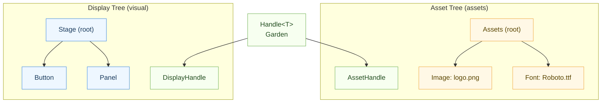
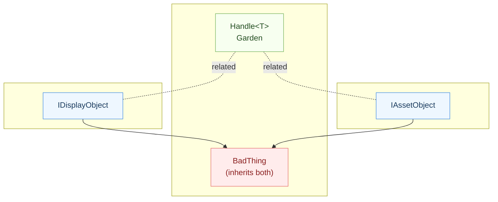
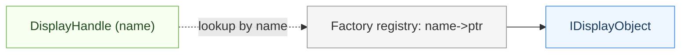

# Object Handles in SDOM

<table>
	<tr>
		<td style="width: 200px; vertical-align: top;">
			
		</td>
			<td style="vertical-align: top; padding-left: 12px;">
				Like two trees in a garden—one bearing the leaves and branches you can see, and one with roots that quietly nourish—SDOM separates concerns into two living structures. The <strong>visual tree</strong> is composed of <code>IDisplayObject</code> nodes that form the interactive scene: they receive events, participate in layout and anchoring, and render to the screen. In parallel, the <strong>asset tree</strong> is composed of <code>IAssetObject</code> nodes that hold images, fonts, audio, and configuration—everything the visuals consume, but which is not itself part of the scene graph. <code>DisplayHandle</code> safely references nodes in the visual tree, while <code>AssetHandle</code> safely references assets in the asset tree, preventing accidental cross-use and eliminating dangling references. Keeping these trees distinct avoids “grafted” diamond-inheritance pathologies, clarifies lifecycles and traversal, and keeps ownership predictable as your application grows.
			</td>
	</tr>
  
</table>

---

## Two Trees in the Garden


</details>

Why two trees
- Clear separation of UI logic vs. asset management.
- Independent lifecycles and traversal patterns.
- Type-safe handles (`DisplayHandle`, `AssetHandle`) prevent accidental mixing.

## Overview

In SDOM, a handle is a small, typed, value object that identifies something by name and type, then resolves it on demand through the Factory. `DisplayHandle` refers to nodes in the visual tree (`IDisplayObject`), while `AssetHandle` points to assets in the asset tree (`IAssetObject`). Each handle carries only two strings (name and type), making it cheap to copy, easy to compare, and safe to pass across boundaries (e.g., Lua scripts, configs, or tooling).

Resolution is lazy: when you call `get()`, dereference (`->`/`*`), or convert to `bool`, the handle consults the Factory’s registry to fetch the current live object for that name/type. This indirection cleanly decouples the producer of a reference from the owner of the object. As long as the Factory keeps its name→pointer map up to date, existing handles remain valid even if objects are recreated or resources are reloaded behind the scenes. Conversely, a missing or stale entry simply yields a null handle (`!handle`), which you can detect via `isValid()`.

Handles are first-class participants throughout the API. Events carry `DisplayHandle` for their `target`, `currentTarget`, and `relatedTarget`, which makes them easy to log (name/type) without leaking raw pointers. UI code can store `DisplayHandle` for parent/child relationships or late-bound lookups, while systems that need assets (images, fonts, audio, configuration) use `AssetHandle` to request them from the asset tree. The split between `DisplayHandle` and `AssetHandle` enforces at the type level that display logic never “accidentally” treats an asset like a DOM node (and vice versa), preserving the integrity of the two-tree design.

Key properties at a glance:
- Type-safe: `DisplayHandle` and `AssetHandle` are distinct types, preventing cross-tree misuse.
- Lightweight: stores name/type strings; copyable, comparable, and nullable.
- Portable: ideal for events, persistence, and tooling; you can reconstruct a handle from name/type in your preferred scripting/config system.
- Stable by indirection: resolution goes through the Factory so ownership and lifetimes stay centralized.
- Practical null semantics: missing entries resolve to null; check with `isValid()` or `if (handle)`.

## Handle Types

### 1. DisplayHandle

- **Purpose:** References DOM objects (display objects) in the scene graph.
- **Underlying Type:** Points to `IDisplayObject`.
- **Usage:** Used for event targets, parent/child relationships, and DOM traversal.
- **Benefits:** Type-safe access to display object members without casting.

### 2. AssetHandle

- **Purpose:** References file-based assets (bitmaps, sounds, fonts, etc.).
- **Underlying Type:** Points to `IAssetObject`.
- **Usage:** Used for asset management, loading, and access.
- **Benefits:** Keeps asset logic separate from DOM logic.

## Design Rationale

- **Separation of Concerns:** DOM objects and resources have different lifecycles and usage patterns.
- **Type Safety:** Prevents accidental mixing of handles and objects.
- **Clarity:** Code is easier to read and maintain.

---

## Inheritance Warning: Avoid Diamond Inheritance


</details>

Best practice
- Do not inherit from both `IDisplayObject` and `IAssetObject` in the same class.
- Keep types clearly in one tree or the other to avoid ambiguity and subtle bugs.

## Example Usage

```cpp
DisplayHandle buttonHandle = factory.getDisplayHandle("Button1");
IDisplayObject* button = buttonHandle.get();

AssetHandle imageHandle = factory.getAssetHandle("LogoImage");
IAssetObject* image = imageHandle.get();
```

## Migration Strategy

-- Refactor all existing `ResourceHandle` usages for display objects to `DisplayHandle`.
-- Introduce `AssetHandle` for new asset types.
-- Update Factory and registry to support both handle types.

## Best Practices

- Always use the appropriate handle type for the object/resource.
- Do not expose public mutators for critical relationships (e.g., parent/child in DOM).
- Use provided methods for tree and resource manipulation.

---

## Optional: Handle Resolution Flow (reference)



</details>
